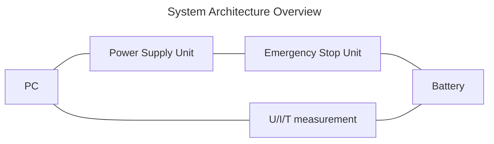

# Overview

## Requirements

- General
    - [ ] Output Voltage $0V$ to $5V$
    - [ ] Output Current $-20A$ to $+20A$
    - [ ] Voltage Measurement (triggered)
    - [ ] Current Measurement (triggered)
    - [ ] Temperature Measurement (triggered)
    - [ ] Voltage Controlled Mode
    - [ ] Current Controlled Mode
    - [ ] Power Controlled Mode
    - [ ] Programmable measurements
    - [ ] Programmable drive cycles
    - [ ] Fast response time to allow programming of wave form
- Safety
    - [ ] Temperature range emergency stop
    - [ ] Voltage range emergency stop
- Security
    - [ ] ESD Protection
    - [ ] [DGUV 203-049][dguv] test

[dguv]: (https://publikationen.dguv.de/widgets/pdf/download/article/829)

## System Design

| Component           | Description                                |
|:--------------------|:-------------------------------------------|
| PC                  | Raspberry Pi                               |
| Power Supply Unit   | 2 Quadrant Bus Programmable                |
| U/I/T measurement   | tbd                                        |
| Emergency Stop Unit | Relay with Voltage and Temperature Control |
