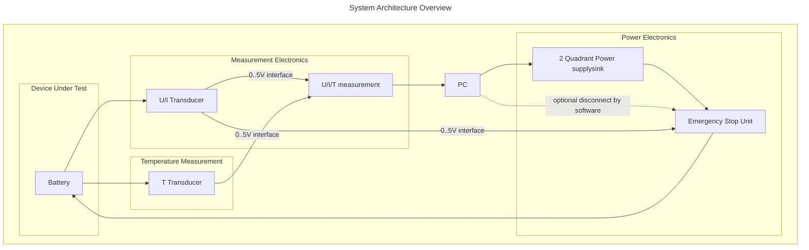

# Overview

## Requirements

- General
    - [ ] Output Voltage $0V$ to $5V$
    - [ ] Output Current $-20A$ to $+20A$
    - [ ] Voltage Measurement (triggered) (accuracy wish 1mV / 5V)
    - [ ] Current Measurement (triggered) (accuracy wish 1mA / 20A)
    - [ ] Temperature Measurement (triggered)
    - [ ] Voltage Controlled Mode
    - [ ] Current Controlled Mode
    - [ ] Power Controlled Mode
    - [ ] Programmable measurements
    - [ ] Programmable drive cycles
    - [ ] Fast response time to allow programming of wave form
- Safety
    - [ ] Temperature range emergency stop
    - [ ] Voltage range emergency stop
    - [ ] [DGUV 203-049][dguv] test
- Security
    - [ ] ESD Protection

[dguv]: (https://publikationen.dguv.de/widgets/pdf/download/article/829)

## Open Points

- Which component should measure ambient temperature?
    - Include in U/I Transducer?
    - Include in T measurement of Battery?
    - Create new component?
- PC software supervision?
    - e.g. WDOG functionality?
    - Which component should be supervising?
    - PC is not safety relevant at the moment. (Note from PaGu point of view: It
      is not planned to be safety relevant in the future. Is it worth adding the
      feature? Team discussion + decision is desired.)
- How much redundancy is required for safety relevant parts?
    - Redundant battery temperature measurement?

## System Design

| Component           | Safety Relevant | Description                                             |
|:--------------------|:----------------|:--------------------------------------------------------|
| PC                  | No              | Raspberry Pi                                            |
| Power Supply Unit   | No              | 2 Quadrant Bus Programmable                             |
| Emergency Stop Unit | Yes             | Relay with Voltage and Temperature Control              |
| T Transducer        | Yes             | Transduces Temperature to voltage signal                |
| U/I Transducer      | Yes             | Transduces U/I to voltage signal                        |
| U/I/T measurement   | No              | Measurement of voltage signals                          |
| Transducer          | Yes             | Transducer of Voltage, Current and Temperature to "TBD" |
