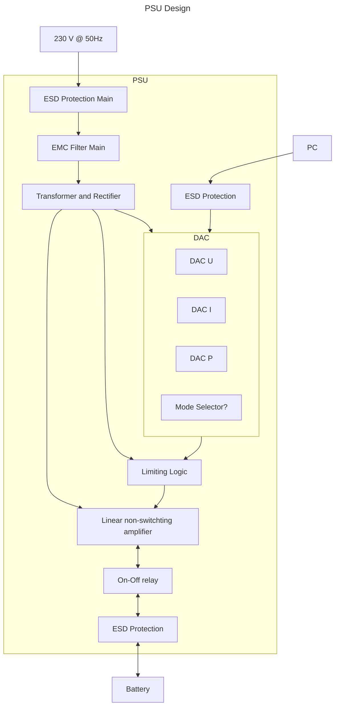

# Power Supply Unit

The Power Supply Unit is controlled from the PC via a programmable bus interface
to set the desired voltage, current or power.

## Block Diagram

## Design Choices Reasoning

### Linear Amplifier

The considered benefits of using a linear amplifier over using a switching
amplifier are:

Advantages:

- easy to control electronically
- fast response time
- stable very low ripple output
- no switched elements with high EMR

Disadvantages:

- low efficiency for large voltage drops and large currents
- requires cooling

### Usage options of Keysight U2722A

The SMU `Keysight U2722A` offers current and voltage source control with
concurrent measurement with 4 Quadrant operation in the ranges of:

- $\pm 20 V$
- $\pm 120 mA$

As the current of the SMU is far to low for the considered application with
obat, if the SMU shall be used as a "driving" component in obat the output
current and therefore output power has to be amplified.

!!! info
    So far [^1] no suitable circuit was identified, which is applicable to amplify
    the output current without significant disadvantages. Following investigated
    options and their problems are listed.
    Therefore a usage of the of the SMU as high precision measurement equipment
    is targeted.

#### Complementary Emitter Follower

With a complementary emitter follower it is expected that the desired current
gain can be achieved relatively easy. The circuit is discussed in literature
(Chapter 17.2 [^TSEC]).

Complementary emitter followers with some additional circuitry are discussed by
Tietze and Schenk in Chapter 17.9 [^TSEC] for "boosting the output of integrated
operational amplifiers".

In any case the following disadvantages are determined:

- The complementary emitter follower acts as a controlled voltage source and the
    current gain is not constant. No feedback of the drawn or supplied current
    can be measured by the SMU, when a voltage is forced.
- The complementary emitter follower is voltage controlled and cannot be
    controlled by an input current in the default case.
- Additional current limiting circuitry is typically **not** dependent on the
    input current as desired.

#### Complementary Current Mirrors

Current mirrors provide a constant current gain. They provide a current input
and current output. In a complementary setup they could potentially be used to
amplify the output current of the SMU. They are discussed by Tietze and Schenk
in Chapter 4.1 [^TSHST] and Chapter 12.4 [^TSHST].

The main disadvantages are:

- The voltage "gain" of current mirrors is generally not constant. Therefore no
    feedback of the voltage at the DUT can be measured by the SMU, when a
    current is forced.
- A current mirror is controlled by an input current and cannot be controlled by
    an input voltage in the default case.

#### Current - Current Operational Amplifier (CC-Opamp)

A CC-Opamp is an operational amplifier with current input and current output.
The internal structure and working principle is described by Tietze and Schenk
in Chapter 5.5 [^TSHST] and some example types are given in Chapter 5.6 on page
592 [^TSHST].
CC-Opamps face the same problems as described for the [complementary current
mirrors](#complementary-current-mirrors). As they cannot easily be used with a
voltage input.

[^1]: As state of Jan 16, 2024

[^TSEC]: 1991, Tietze, U. and Schenk, Ch.,
    "Electronic Circuits Design and Applications", Vol. 9,
    Springer-Verlag Berlin Heidelberg

[^TSHST]: 2002, Tietze, U. and Schenk, Ch.,
    "Halbleiter-Schaltungstechnik", 12. Auflage,
    Springer-Verlag Berlin Heidelberg
