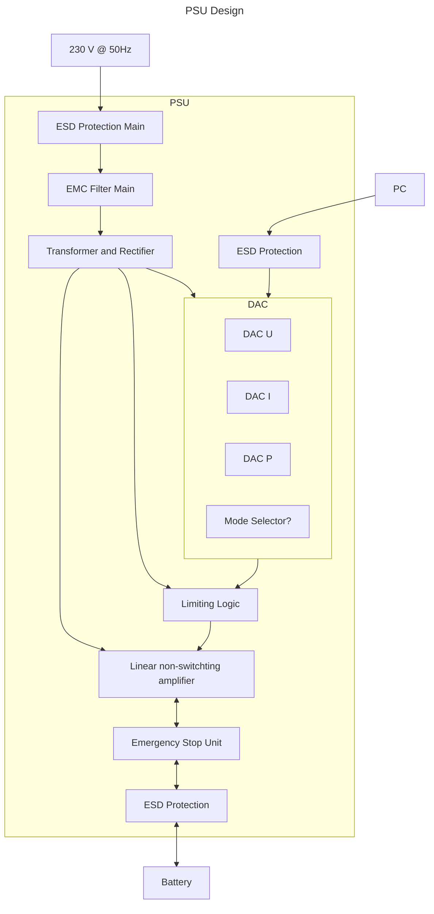

# Power Supply Unit

The Power Supply Unit is controlled from the PC via a programmable bus interface
to set the desired voltage, current or power.

## Block Diagram

## Design Choices Reasoning

### Linear Amplifier

The considered benefits of using a linear amplifier over using a switching
amplifier are:

Advantages:

- easy to control electronically
- fast response time
- stable very low ripple output
- no switched elements with high EMR

Disadvantages:

- low efficiency for large voltage drops and large currents
- requires cooling
