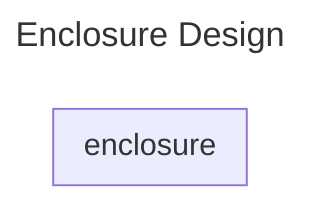

# Enclosure

The enclosure is controlled from the PC via a programmable bus interface
to set the desired heating and cooling. A adapted pcb card is created to interface
to the mechanical enclosure.

## Mechanical Documentation

Mechanical documentation for the construction of enclosure "box", which is contributed
by the WING faculty is provided in [./mechanical/](./mechanical/mechanical.md)

## Electrical Documentation

## Interface & Requirements

TODO: Add Input specs
TODO: Add Output specs
TODO: Add Power Consumption

1. Voltage inputs
    - analog with $U \in [0V, 5V]$ with $R < 100 \Omega \forall I < 1mA$
    - analog with $U \in [0V, 5V]$ with $R < 100 \Omega \forall I < 20mA$
    - digital positive logic with $U \in [-5V, 10V]$, driving up to $I = 1 mA$
    load
2. Voltage output
    - analog with $U \in [0V, 5V]$ with $R < 100 \Omega \forall I < 1mA$
    - analog with $U \in [0V, 5V]$ with $R < 100 \Omega \forall I < 20mA$
    - digital positive logic with $U \in [-5V, 10V]$, driving up to $I = 1 mA$
    load
3. Supply Voltages
    - $+10V$ @ $1W$ ($100mA$)
    - $-5V$ @ $0.5W$ ($50mA$)

## Circuit Selection and Design

### Circuit

TODO: Add circuit description

#### Block Diagram

### Component Selection

TODO: Add component selection

## Simulation

TODO: Add simulation

## Layout and Assembly Considerations

### PCB Layout

### Assembly

TODO: Add test pins
TODO: Add (dic-)connector note, with testcase required for connecting

## Commissioning and Testing

TODO: Add special hints for Assembly or remove

### Dummy Test

TODO: add tests

Test ID: `v1.0.0/enclosure/dummy/<suffix>`

Available suffix:

- `dummy0`
- `dummy1`

1. Do this
2. Do that
3. Test pass condition
