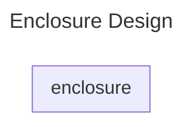

# Enclosure

The enclosure is controlled from the PC via a programmable bus interface
to set the desired heating and cooling. A adapted pcb card is created to interface
to the mechanical enclosure.

## Mechanical Documentation

Mechanical documentation for the construction of enclosure "box", which is contributed
by the WING faculty is provided in [./mechanical/](./mechanical/mechanical.md)

## Interface & Requirements

1. SPI Input Interface
    - digital with $U \in [0V, 5V]$ relative to isolated ground `GNDI`
    isolation voltage max $V_{iso} = 500V$
        - `!CS_ISO`, input, chip select, low active
        - `SCLK_ISO`, input, serial clock CPHA=0, CPOL=0=`SCKL`
        - `SDI_ISO`, input, serial data in
        - `SDO_ISO`, output, serial data out
2. Voltage output (non isolated with respect to supply voltages)
    - Digital PWM output with 24V up to 2.5A current for the heating element
    - Digital PWM output with 24V up to 6A current for the peltier element,
    setable polarity for heating and cooling
    - Digital PWM output with 12V up to 200mA current for the fan
3. Supply Voltages
    - $+24V$ @ $200W$ ($8.3A$)

## Circuit Selection and Design

### Circuit

TODO: Add circuit description

#### Block Diagram

### Component Selection

TODO: Add component selection

## Simulation

TODO: Add simulation

## Layout and Assembly Considerations

### PCB Layout

### Assembly

TODO: Add test pins
TODO: Add (dic-)connector note, with testcase required for connecting

## Commissioning and Testing

TODO: Add special hints for Assembly or remove

### Dummy Test

TODO: add tests

Test ID: `v1.0.0/enclosure/dummy/<suffix>`

Available suffix:

- `dummy0`
- `dummy1`

1. Do this
2. Do that
3. Test pass condition
