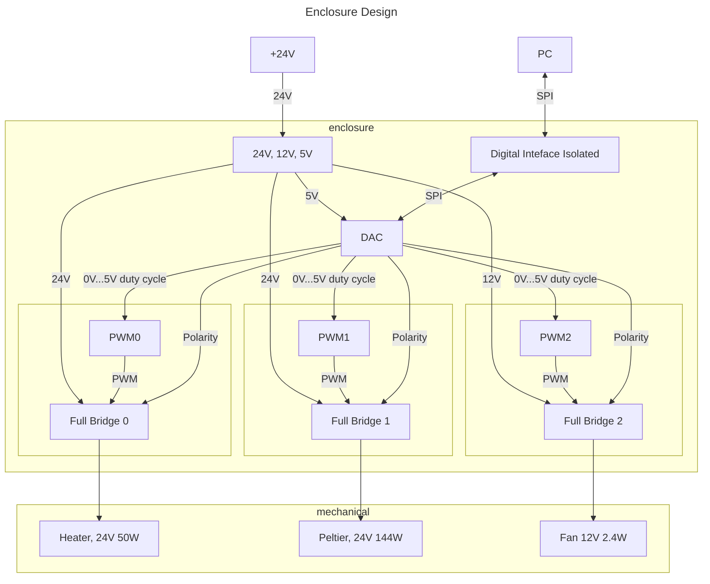

# Enclosure

The enclosure is controlled from the PC via a programmable bus interface
to set the desired heating and cooling. A adapted pcb card is created to interface
to the mechanical enclosure.

## Mechanical Documentation

Mechanical documentation for the construction of enclosure "box", which is contributed
by the WING faculty is provided in [./mechanical/](./mechanical/mechanical.md)

## Interface & Requirements

1. SPI Input Interface
    - digital with $U \in [0V, 5V]$ relative to isolated ground `GNDI`
    isolation voltage max $V_{iso} = 500V$
        - `!CS_ISO`, input, chip select, low active
        - `SCLK_ISO`, input, serial clock CPHA=0, CPOL=0=`SCKL`
        - `SDI_ISO`, input, serial data in
        - `SDO_ISO`, output, serial data out
2. Voltage output (non isolated with respect to supply voltages)
    - Digital PWM output with 24V up to 2.5A current for the heating element
    - Digital PWM output with 24V up to 6A current for the peltier element,
    setable polarity for heating and cooling
    - Digital PWM output with 12V up to 200mA current for the fan
3. Supply Voltages
    - $+24V$ @ $200W$ ($8.3A$)

## Circuit Selection and Design

### Circuit

The spi interface is used to control a digital-to-analog converter, which is
used to generate analog voltages in the range of 0V - 5V. The analog voltages
are used to generate a PWM for the corresponding outputs. The polarity can be
selected by using only the 0V or 5V state of the digital-to-analog converters
output.

The PWM signal is used to drive a full bridge driver, which supplies the
required output current from the power supply to the load.

12V are derived from the 24V supply on the enclosure pcb for usage at the fan.
5V are derived from the 24V supply on the enclosure pcb for usage of logic
circuits and the dac.

#### Block Diagram

### Component Selection

## Simulation

## Layout and Assembly Considerations

### PCB Layout

### Assembly

## Commissioning and Testing

1. Pass tests for `power`
2. Pass tests for `digital-interface`
3. Pass tests for `dac`
4. Pass tests for `pwm`
5. Pass tests for `full-bridge`
6. Connect Jumpers
7. Pass tests for `enclosure` from below

### Fan

Test ID: `v1.0.0/enclosure/fan`

1. Connect Fan to `enclosure`
2. Program Fan to 100% duty cycle from `pc`
3. Measure current through fan
    - $I_{fan,100}$
4. Program Fan to 25% duty cycle from `pc`
5. Measure current through fan
    - $I_{fan,25}$
6. Test passed if
    - $I_{fan,100} > I_{fan,25}$
