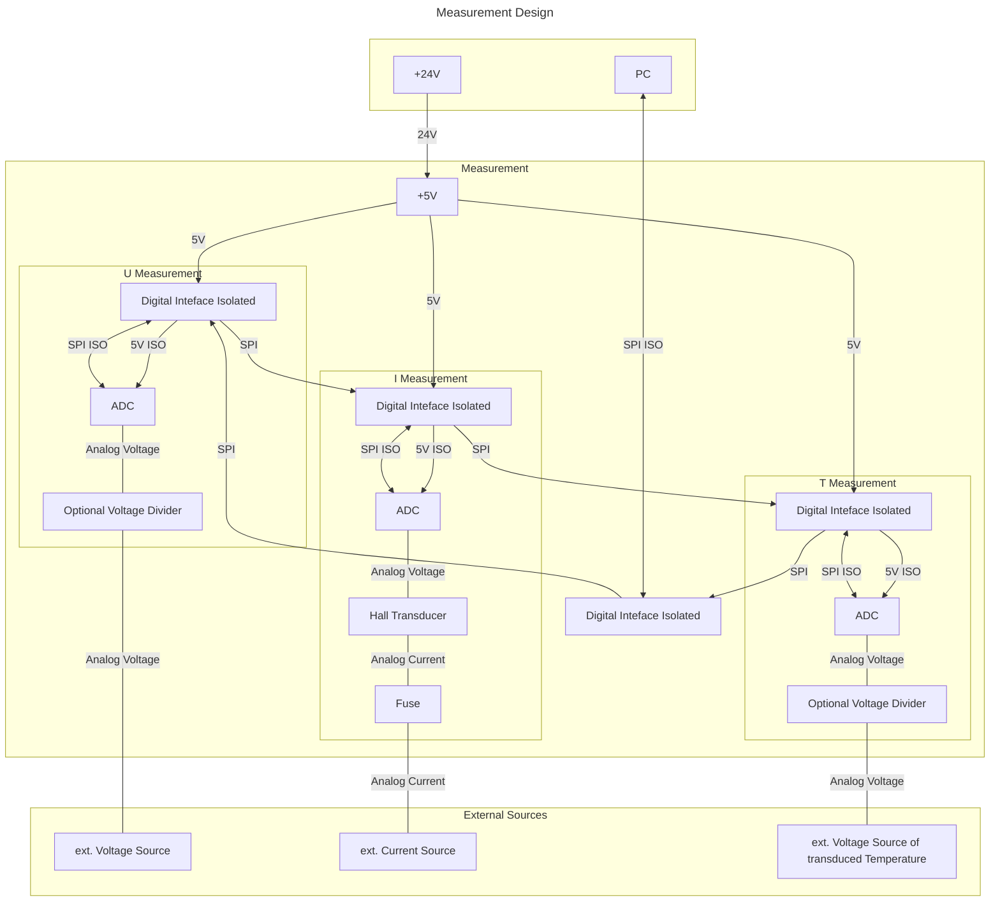

# U / I / T Measurement

## Interface & Requirements

1. SPI Input Interface
    - digital with $U \in [0V, 5V]$ relative to isolated ground `GNDI`
    isolation voltage max $V_{iso} = 500V$
        - `!CS_ISO`, input, chip select, low active
        - `SCLK_ISO`, input, serial clock CPHA=0, CPOL=0=`SCKL`
        - `SDI_ISO`, input, serial data in
        - `SDO_ISO`, output, serial data out
2. Measurement Inputs
    - analog with $U \in [0V, 5V]$ with $R < 1k \Omega \forall I < 1mA$
        - `V_MEAS+` and `V_MEAS-`, high impedance input measuring the voltage
        - `T_MEAS+` and `T_MEAS-`, high impedance input measuring the
        transduced voltage representing the temperature
        - `I_MEAS+` and `I_MEAS-`, low impedance input measuring the current
3. Supply Voltages
    - $+24V$ @ $4.8W$ ($200mA$)

## Circuit Selection and Design

### Circuit

To measure the voltage signals in the range of 0V to 5V an ADC is used to
convert the analog voltage signal into a digital signal. The current is
transduced into a voltage by the use of a hall based transducer and the
transduced voltage is measured with an ADC.

The different measurement "units" are galvanically isolated by employing
isolated DC/DC converters and digital data isolation.

#### Block Diagram

### Component Selection

TODO: Add component selection

## Simulation

TODO: link to simulation files

## Hardware tests in Laboratory

## Layout and Assembly Considerations

### PCB Layout

- Pull up/down for inputs, when stage is isolated, to run other tests.
TODO: Add test pins
TODO: Add (dic-)connector note, with testcase required for connecting

### Assembly

TODO: Add special hints for Assembly or remove

## Commissioning and Testing

TODO: add tests

### Testheading

Test ID: `v1.0.0/pss/control-logic/control/sign-propagation/<suffix>`

1. Connections
    - Output `out` disconnected
    - Input `meas` connected to $U_{meas} = 0V$
    - Input `ref` connected to $U_{ref} = +500mV$
2. Power on supply voltage
3. Wait for steady state $t_{wait} \gtrapprox 1ms$
4. Measure Voltages
    1. Error Signal (test id suffix: `error`)
        - Voltage at subtraction output $U_{e}$
    2. Output Signal (test id suffix: `output`)
        - Voltage at PID controller output $U_{out}$
5. Power off supply voltage
6. Test passed if
    1. Error Signal (test id suffix: `error`)
        - $U_{e} \in 500mV (1 \pm 10\%)$
    2. Output Signal (test id suffix: `output`)
        - $U_{out} \in 10V (1 \pm 10\%)$
