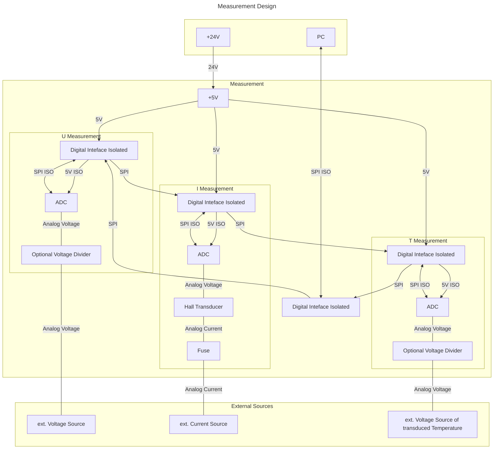

# U / I / T Measurement

## Interface & Requirements

1. SPI Input Interface
    - digital with $U \in [0V, 5V]$ relative to isolated ground `GNDI`
    isolation voltage max $V_{iso} = 500V$
        - `!CS_ISO`, input, chip select, low active
        - `SCLK_ISO`, input, serial clock CPHA=0, CPOL=0=`SCKL`
        - `SDI_ISO`, input, serial data in
        - `SDO_ISO`, output, serial data out
2. Measurement Inputs
    - analog with $U \in [0V, 5V]$ with $R < 1k \Omega \forall I < 1mA$
        - `V_MEAS+` and `V_MEAS-`, high impedance input measuring the voltage
        - `T_MEAS+` and `T_MEAS-`, high impedance input measuring the
        transduced voltage representing the temperature
        - `I_MEAS+` and `I_MEAS-`, low impedance input measuring the current
3. Supply Voltages
    - $+24V$ @ $4.8W$ ($200mA$)

## Circuit Selection and Design

### Circuit

To measure the voltage signals in the range of 0V to 5V an ADC is used to
convert the analog voltage signal into a digital signal. The current is
transduced into a voltage by the use of a hall based transducer and the
transduced voltage is measured with an ADC.

The different measurement "units" are galvanically isolated by employing
isolated DC/DC converters and digital data isolation.

#### Block Diagram

### Component Selection

The isolation interface of the powersupplysink `pss` is reused to achieve
digital isolation of the individual measured quantities. The ADC and current
transducer circuits are also reused from `pss`.

## Simulation

Not available.

## Hardware tests in Laboratory

## Layout and Assembly Considerations

### PCB Layout

- Pull up/down for inputs, when stage is isolated, to run other tests.

### Assembly

## Commissioning and Testing

### Voltage Measurement

Test ID: `v1.0.0/meas/voltage`

1. Connections
    - Voltage `V_MEAS+` to `V_MEAS-` $U_{in}=3V$
2. Power on supply voltage
3. Measure Voltage via SPI $U_{spi}$
4. Power off supply voltage
5. Test passed if
    - $U_{spi} \in U_{in} (1 \pm 0.05)$

### Temperature Measurement

Test ID: `v1.0.0/meas/temperature`

1. Connections
    - Voltage `T_MEAS+` to `T_MEAS-` $U_{in}=3V$
2. Power on supply voltage
3. Measure Voltage via SPI $U_{spi}$
4. Power off supply voltage
5. Test passed if
    - $U_{spi} \in 0.5 \cdot U_{in} (1 \pm 0.05)$

### Current Measurement

Test ID: `v1.0.0/meas/current`

1. Connections
    - Voltage `I_MEAS+` to `I_MEAS-` $I_{in}=3A$
2. Power on supply voltage
3. Measure current via SPI $I_{spi}$
4. Power off supply voltage
5. Test passed if
    - $U_{spi} \in I_{in} \pm 500 mA $
