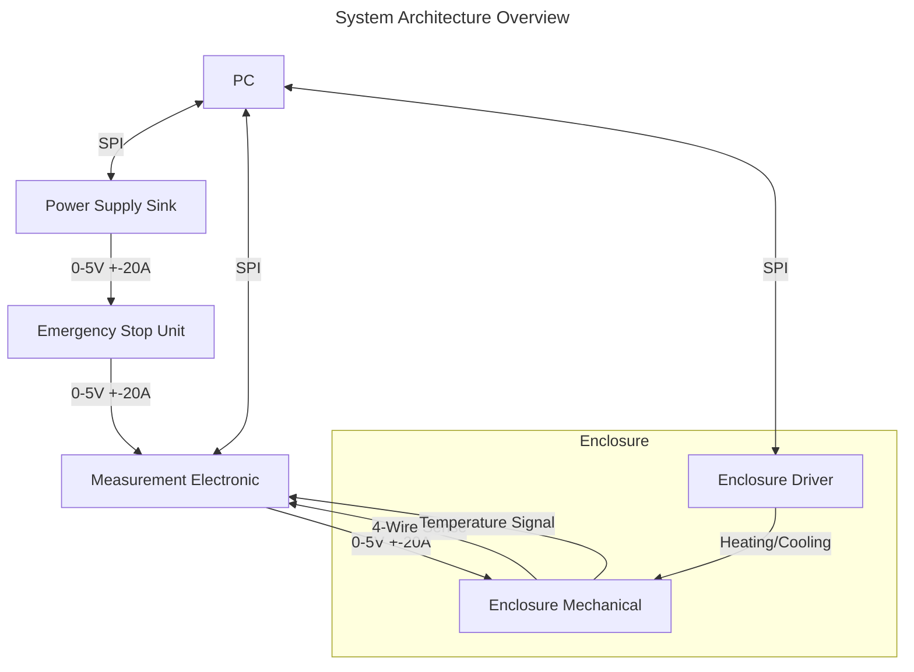

# Open Battery Tester

|   |  |
| ------------- | -------------- |
|   |  |

```mermaid
---
title: System Architecture Overview
---
flowchart TD
    pc[PC]

    pss[Power Supply Sink]

    esu[Emergency Stop Unit]

    meas[Measurement Electronic]

    subgraph enclosure [Enclosure]
        enclosure_electronical[Enclosure Driver]
        enclosure_mechanical[Enclosure Mechanical]
    end

    pc <-->|SPI| pss & meas & enclosure_electronical
    pss -->|0-5V +-20A| esu -->|0-5V +-20A| meas -->|0-5V +-20A| enclosure_mechanical
    enclosure_mechanical --> |4-Wire Sense| meas
    enclosure_mechanical --> |Temperature Signal| meas
    enclosure_electronical -->|Heating/Cooling| enclosure_mechanical
```
