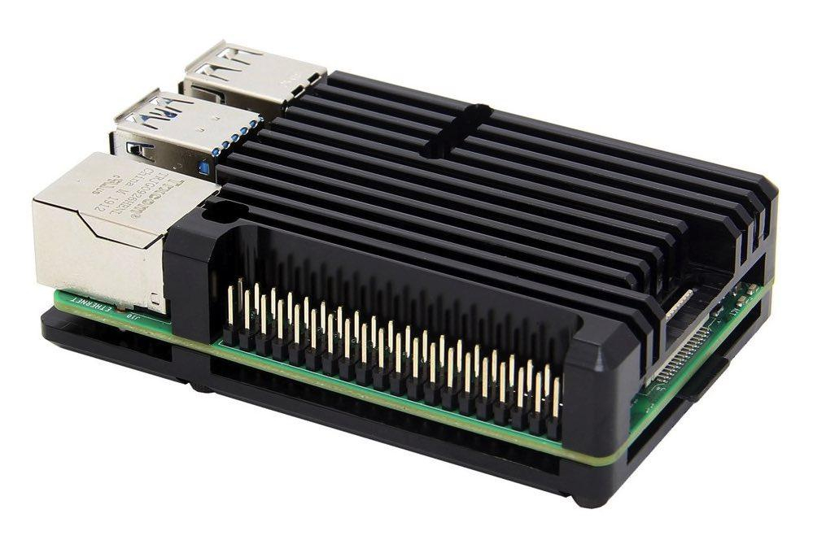

# Programmable Controller

The PC controls the other components in the system directly or indirectly. Data
can be read from and commands can be written to the other components by
utilizing the digital interface of the corresponding component. The digital
interface available to interface with the `PowerSupplySink` is SPI.

The PC consists of

- x86 personal computer  
  running _Lubuntu_ a resource efficient linux distribution based on _Ubuntu_.
- human interface
    - keyboard & mouse combo device
    - monitor for display
- USB to SPI converter
- wires, connectors, wall adapter

## Available Option for Upgrade

The currently used PC system is chosen because of cheap second hand
availability of the particular hardware. If funds for future upgrades exist the
system could be upgraded in favor of

- computational performance
- more RAM -> allows install of "regular" Ubuntu
- abolish the dedicated USB to SPI converter

by using e.g. the following. Price (incl. shipping) 83,70€ at 21. Oct. 2024 on
[Berrybase]

- [Raspberry Pi 4 Computer Modell B, 4GB RAM][RPi4B]  
  Artikel-Nr.: RP14B-4GB
- offizielles Raspberry Pi USB-C Netzteil 5,1 V / 3,0A  
  Artikel-Nr.: RP14NT3AB
- Armor Gehäuse für Raspberry Pi 4, schwarz  
  Artikel-Nr.: RP14-ARC-BL
- Raspberry Pi microSDXC Speicherkarte, A2, Class 10, U3, 64GB  
  Artikel-Nr.: RPl-MSD-64
- High Speed Micro HDMI Kabel mit Ethernet schwarz 0,50 m  
  Artikel-Nr.: 77470-0.5-3
- Adapter, HDMI Typ A Buchse - DVI-D (24+1) Stecker, schwarz  
  Artikel-Nr.: 77401

[RPi4B]: ../../datasheet/raspberry-pi-4-datasheet.pdf
[Berrybase]: https://www.berrybase.de/
