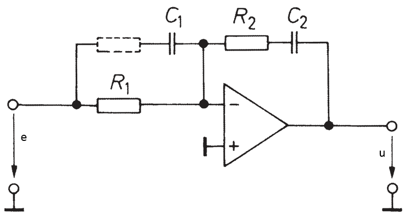
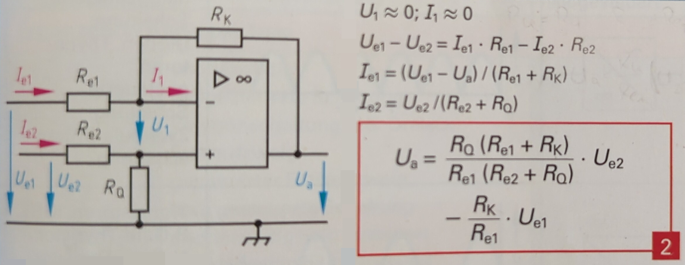

Control
=======

Interface & Requirements
------------------------

- Voltage Input `ref` & `meas`
    - Voltage Input Swing $V_{in} \in [0V, +5V]$
    - Input Current $| \pm I_{in} | \leq 2.3mA$
- Voltage output `out`
    - In phase with $V_{ref}$
    - $V_{out} \in [-5V, 10V]$
    - Output current $I_{out \pm} \geq \pm 800 mA$
- Supply Voltages
    - $+10V$ @ $1W$ ($100mA$)
    - $-5V$ @ $0.5W$ ($50mA$)

Circuit Selection and Design
----------------------------

### Circuit

As the circuit a classical control loop is selected with a reference that should
be tracked by minimizing the error.
The PID controller is implemented using a standard circuit from literature [^TB]:

The difference junction is implemented using a standard subtraction circuit
from literature [^TB]: 

[^TB]: Europa-Lehrmittel, Tabellenbuch Elektrotechnik, 2018

#### PID Controller Component Values

The parasitic capacitance together with the resistance of $R_{K1} + R_{K2}$ acts
as a low pass filter, which adds a pole to closed loop system. In order to
neglect the influence of the pole it's frequency should be higher than the
operating frequency. For the [OPA2810IDR] the parasitic capacitance
$C_{parasitic} \approx C_{in} + C_{diff} = 3 pF$. For a operating frequency $f
= 10 MHz$ a higher frequency of $f' = 2 \cdot f = 20 MHz$ is chosen and the
feddback resistance is limited by:
$$ R_{K1} + R_{K2} < \frac{1}{2 \pi f' C_{parasitic}} = 2.65 k \Omega $$

A lower limit of the feedback resistance is imposed by the maximum output
current of the [OPA2810IDR]. The maximum continous output current is $40mA$,
but to limit the thermal stress
of the device the output current is desired to not exceed $30mA$. The current
available for the feedback path is the remaining current, which is not used for
the following bias stage.
$$ R_{K1} + R_{K2} > \frac{U_{signal,max}}{I_{out,max} - I_{bias}} \approx
\frac{10V}{30mA - 20mA} = 1k \Omega $$

Thus the range considering the integration time $T_i$ is
$$ C_{K1} = \frac{T_i}{R_{K1}+R_{K2}} \in [89 pF, 236 pF] $$

Choosing from E6 $C_{K1} = 100pF \implies R_{K1}+R_{K2} = 2.36 k \Omega$.

To reuse same component values we can choose
$$ C_{K2} = 100pF = C_{K1} \implies
R_{K1} || R_{K2} = \frac{T_d}{C_K2} = 588 \Omega \approx 0.5 (R_{K1}+R_{K2}) $$

Thus we can select $$ R_{K1} = R_{K2} = 1.2 k \Omega $$
$$ \implies R_1 = \frac{R_{K1}+R_{K2}}{K_P} = 240 \Omega $$.

#### Difference Junction

To minimize the number of different components at unity gain for each channel
of the subtraction circuit we choose R_{e1} = R_{e2} = R_K = R_Q$.
The same restrictions apply for the feedback resistance as in the PID
controller, because the input resistance of the PID with
$$ R_{in,PID} \approx R_1 = 240 \Omega \implies I_{in,PID,max} \approx
\frac{u_{e,max}}{R_{in,PID}} = 20 mA $$.

Therefore we can select
$$ R_{e1} = R_{e2} = R_K = R_Q = 2.2 k \Omega $$

#### High Impedance Input Drive

To drive the inputs in a defined state when no preceding stage is connected
either during testing or when the `limit-logic` is performing a mode transition
and the multiplexer is switching in a gapping manner high impedance input drive
is used. The high impedance makes it possible to override the signal by a low
impedance source from the multiplexer. The reference `ref` of the controller is
connected to some voltage which it should follow, and the measurement `meas` of
the controller is connected to the output of the controller. The feedback path
from the controller output to the `meas` input can be neglected during the
normal operation of the controller, because the voltage on both terminals of
the resistor is driven by low impedance sources. Similarly, the voltage high
impedance voltage source driving the reference `ref` can be neglected during
normal operation, because the reference voltage will be driven by a low
impedance voltage source, which delivers the required current to force the
voltage across resistance of the high impedance voltage source.This assumes the
current through the resistance is small enough to be driven by both sources.

The high impedance of the input drive is connected in series to the resistors
$R_{e1}$ and $R_{e2}$ during gapping operation. Therefore the gain of the
difference junction is reduced. To obtain equal reduction of gain the impedance
of the feedback resistance should be equal to that of the voltage source
connected to the reference.

A value of $$ R = 1 M \Omega $$ can be chosen for the feedback resistor and the
impedance of the voltage source, which is able to

- neglect the currents required to drive the normal voltages during normal
operation
- neglect the input currents required by the operational amplifier during
gapping operation
- enable reuse of existing pull up/down resistors and increase the quantity of
a single component value

To choose an appropriate "default" voltage for the controller reference during
gapping a constant voltage can be used. This will yield easy implementation,
but introduces unnecessary voltage swing of the controller, when the default
voltage is not inside of the interval defined by the voltage before and after
the switching. To reduce the amount of unnecessary voltage swing a RC-lowpass
filter is used to obtain the reference voltage during normal operation and keep
it almost constant during the gapping switching. This requires that the
switching time is much smaller than the time constant of the filter, which is
in turn smaller than the time spent in normal operation.
$$ t_{transition} \approx 330ns << \tau_{RC} << t_{normal} \gtrapprox 1s $$

!!! note "Normal Operation Time"
    The time used for $t_{normal}$ is based on the expected behavior of
    connected loads to the powersupplysink. It is therefore tied to the
    expectations an user might have on the device (requirements) and not based
    on simulation or of physical meaning.

The time constant be chosen to be approximately $10ms$ which allows to reuse
the $10nF$ capacitances of the controller with _C0G_ dielectric.
$$ \tau_{RC} \approx 10ms \implies C = 10nF $$

Because the RC-lowpass is connected and discharged to ground via $R_{e2}$ and
$R_Q$ of the difference junction after $t \rightarrow \infty$ the reference
voltage will reach $0V$.

### Component Selection

#### Operational Amplifier

[OPA2810IDR] Selection (sort by Price): $n_{Ch} >= 2$, $GBWP
\approx 100 MHz$, 15V VCC, $SR \approx 150 V / \mu s$

!!! note "GBWP & SR"
    The GBWP is approximated by using the approximate oparating frequency $f$ of
    the closed loop control loop and the desired gain $K_P$.
    $$ GBWP \approx f \cdot K_P = 10 MHz \cdot 10 $$
    The slew rate is approximated by taking the maximum slope of a sine wave at
    maximum amplitude at the approximated operating frequency. $$ SR \approx 2.5V
    \cdot 10 MHz \cdot 2 \pi $$

[OPA2810IDR]: https://mou.sr/3X9Oofi

#### Anti Windup Diode

[1N4148W-7-F] Selection (sort by Price) from search on Mouser

- Small Signal Switching Diode
- in Stock
- SMD/SMT
- Forward Current $I_f > 10mA$
- Recovery Time $\leq 5ns$

[1N4148W-7-F]: https://mou.sr/3Lhk651

Simulation
----------

TODO: link to simulation files

Hardware tests in Laboratory
----------------------------

Layout and Assembly Considerations
----------------------------------

### PCB Layout

- Consider [OPA2810 Datasheet] Section _11 Layout_
- Low impedance decoupling of opamp
- Low impedance feedback of opamp (avoid parasitic capacitance)
- (Dis-) connector between _controller_ and _powerelectronics_, (solderbridge /
  jumper) Label with testname hint
- Add optional connectors from `out` to `meas` for unity plant test.
- Pull up/down for inputs, when stage is isolated, to run other tests.
- Add test pins for: `out`, `ref`, `meas`, `error`

[OPA2810 Datasheet]: <../../../datasheet/opa2810.pdf>

### Assembly

Commissioning and Testing
-------------------------

1. Pass all tests for `control`.
2. If all tests for _powerelectronics_ are passed connect _control_ and
   _powerelectronics_.

### Sign Propagation

Test ID: `v1.0.0/pss/control/sign-propagation/<suffix>`

1. Connections
    - Output `out` disconnected
    - Input `meas` connected to $U_{meas} = 0V$
    - Input `ref` connected to $U_{ref} = +500mV$
2. Power on supply voltage
3. Wait for steady state $t_{wait} \gtrapprox 1ms$
4. Measure Voltages
    1. Error Signal (test id suffix: `error`)
        - Voltage at subtraction output $U_{e}$
    2. Output Signal (test id suffix: `output`)
        - Voltage at PID controller output $U_{out}$
5. Power off supply voltage
6. Test passed if
    1. Error Signal (test id suffix: `error`)
        - $U_{e} \in 500mV (1 \pm 10\%)$
    2. Output Signal (test id suffix: `output`)
        - $U_{out} \in 10V (1 \pm 10\%)$

### Closed Loop Stability for Unity Plant

Test ID: `v1.0.0/pss/control/stability-unity-plant/<suffix>`

1. Connections
    - Output `out` disconnected from following stage
    - Input `meas` connected to output `out` of PID controller
    - Input `ref` connected to $U_{ref} = 2.5V$
2. Power on supply voltage
3. Wait for steady state $t_{wait} \gtrapprox 1ms$
4. Measure Voltages
      - Voltage series $u_{out}(t) at PID controller output with oscilloscope
      for $t = 1s$
5. Power off supply voltage
6. Disconnect input `meas` from output `out` of PID controller
7. Test passed if
    1. Mean Value (test id suffix: `mean`)
        - $\overline{u_{out}(t)} \in 2.5V (1 \pm 1\%)$
    2. Output Signal Boundedness (test id suffix: `bounds`)
        - $\forall t u_{out}(t) \in 2.5V (1 \pm 1\%)$

!!! note
    Passing test `bounds` implies, that test `mean` is passed. Separation of
    test is conducted to make information of instability visible in test report,
    even when the mean is accurately tracked.
