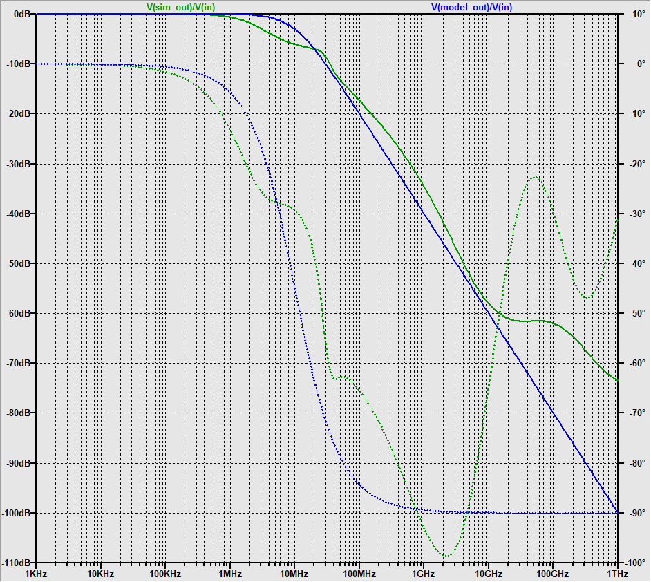
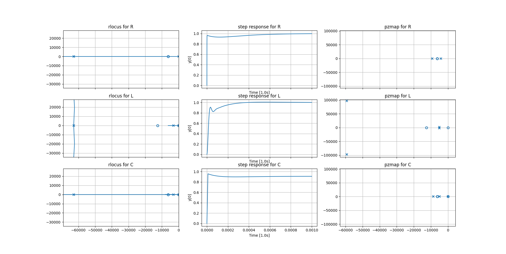

# Controller Design

!!! info "TL;DR"
    PID Controller with: $K_P = 10$, $T_i = 318 \mu s$, $T_d = 80 \mu s$

This page describes the derivation of the mathematical description of the
controller, which is used to control the power electronics. For the
circuit implementation please see `../controller.md`.

## Power Electronics Model

The plant model corresponds to the power electronics including the outstage and
the bias stage. The simulation `../../sim_bias+outstage_ac.asc` is used to
generate the bode plot of power electronics. A first order model is fitted by
manual inspection of the bode plot. The model is expected to be unreliable at
frequencies above $f > 100MHz$.

### Enhancements

The model is only fitted approximately, and for low frequencies the fit can
probably be improved by adding a pair of complex conjugated zeros in the range
$f \in [1 MHz 20 MHz]$. To make the plant model strictly proper the addition of
two poles at high frequencies would also be required. A fitting function via
least square is implemented in `./tfest.py`. The convergence of the estimation
is very slow and results could only be achieved with initial conditions, which
are close to the global extreme.

## PID Controller

The controller design employed should be using output feedback to make
implementation in circuit easier. In the case of the first order model the
output feedback is equivalent to full state feedback and different strategies
for choosing an appropriate controller can be used.
The investigation on how to control the power electronics with different loads
connected for voltage and current was conducted is conducted in two steps:

1. Controller design for voltage control with negligible resistive load. This
   step is used to test the algorithm / strategy with which the controller
   parameters are obtained. The used strategies are:
    1. Linear Quadratic Compensator
    2. Root Locus Method
2. Refinement of controller design for current control with resistive,
   capacitive and inductive loads.

### Linear Quadratic Compensator

A linear quadratic compensator typically is implemented as a full state feedback controller.
The cost function is quadratic and the optimal controller $u = -Kx$ with
respect to the cost function is obtained.
The addition of a performance output which integrates the steady state error is
also known under the name of `lqi`, which is equivalent to a PI controller. An
implementation to calculate lqi controllers is given in `./lqi.py`, which is
applied in `./lqr_pi.py`. The iterative design of the cost function is
difficult, as the desired closed loop poles lie on the real axis and the input
cost as well as the state costs are unknown. The iterations would therefore
only reveal the cost function for which the desired controller is optimal.

### Root Locus Method

Using the root locus method first a PI controller was designed placing the zero
of the controller close to the plant of the pole. Thus with increasing gain the
pole from the integral action of the controller at the origin is moved to the
left on the real axis of the s-plane.

The analysis of the current control for connected impedances showes the
following properties:

- **Resistive**  
  A resistive load does scale the output voltage to a output current. As a real
  valued scalar it does not introduce poles or zeros to the transfer function.
  The resistance should be large enough to limit the current in the operational
  interval: $R > \frac{5V}{20A} = 250 m \Omega$
- **Inductive**  
  An inductive load introduces a pole at $p_I = -\frac{R}{L} = -\frac{1}{\tau}$.
  The critical case is when $R \rightarrow 0, L \rightarrow \infty \implies \tau
  \rightarrow \infty$.
- **Capacitve**  
  A capacitive load introduces a pole at $p_C = -\frac{1}{RC} =
  -\frac{1}{\tau}$. Also a zero at the origin is introduced, which cancels the
  pole of the integral action.

The PI controller can be improved by adding a derivative term, which adds
another zero for the controller. The second zero can be placed close to the
first zero of the controller to allow an increase in performance for the
inductive and capacitive case. Although the some limitations in the case of
current regulation remain:

- For inductive loads the system is not always overdamped. For some loads
  (especially with high $\tau$) the system may have conjugate complex poles,
  which are asymptotically stable.
- For capacitive loads a steady state error will remain which is dependant on
  the circuits parameters. Furthermore this steady state error will practically
  not be achieved for long durations, because of the limited output voltage
  range, which limits the integral wind up.

The following picture depicts the

- root locus plot
- step response and
- pole zero map of the closed loop system

for a gain $K_P = 10$.

!!! info "Python Control"
    The shown pole zero map and root locus plot show scaled frequencies
    $f' = f / 1000$ to avoid limitations of python control, when using `scipy`
    instead of `slycot` for computations.

    The shown pole zero map and root locus plot show the entire system without
    the "high frequency" pole of the plant, because it causes numerical
    instability. The pole is additionally negligible for current control,
    because it is ten times faster, than the current sensor. For voltage control
    the stability is not jeopardized, when the pole is of higher frequency, than
    estimated in the control simulation. (Source: qualitative observation in
    pole zero map for load cases "R", "RL", "RC")

### Gain Margin and Current Control

When in current control the load and current sensor can be seen as a type of
gain in the open loop transfer function. For a small load resistance this gain
gets large. E.g. a small increase of voltage at the `pss` output yields a
current

$$ I = \frac{U_{out}}{R_{load}} $$

This current is transformed into a voltage by the current measurement sensor
with a rate $R_{sens} \approx 100 mV / A$. Therefore a reduced load resistance
will increase the open loop gain and decrease the remaining gain margin of the
open loop system.

The system will become unstable, when the gain margin is reduced to zero.

The minimum required load resistance to keep the gain margin greater than zero
can be determined by the controller open loop gain margin $GM_{-180°}$, the
sensor transformation resistance $R_{sens}$ and the controller gain $K_P$.

$$ R_L > \frac{K_P \cdot R_{sens}}{GM_{-180°}} $$

If the load resistance is close to this value the system will start to
oscillate with very little dampening. To obtain a reasonable amount of damping
the open loop gain margin at $-150°$ phase shift $GM_{-150°}$ can be used to
leave $30°$ of phase margin at the minimum load resistance. $GM_{-150°} \approx
16.5 \widehat{\approx} 24 dB$ is obtained by simulation. Considering the output
resistance of the `outstage` of the `power-electronics` in series with the load
resistance, the load resistance is limited to a lower limit of $R_L \in
[30m\Omega, +\inf)$. By rearranging the formula above a controller gain $K_P$
for which the phase margin of $30°$ is protected can be estimated:

$$ K_P < \frac{R_L \cdot GM_{-150°}}{R_{sens}} \approx 5 $$

### Obtained PID Parameters

The parameters of the pid controller are:
$$ Kp = 5 $$
$$ Ti = 318e-6 \quad \wedge \quad Ki = 1.57e4 $$  
$$ Td = 80e-6 \quad \wedge \quad Kd = 4e-4 $$
