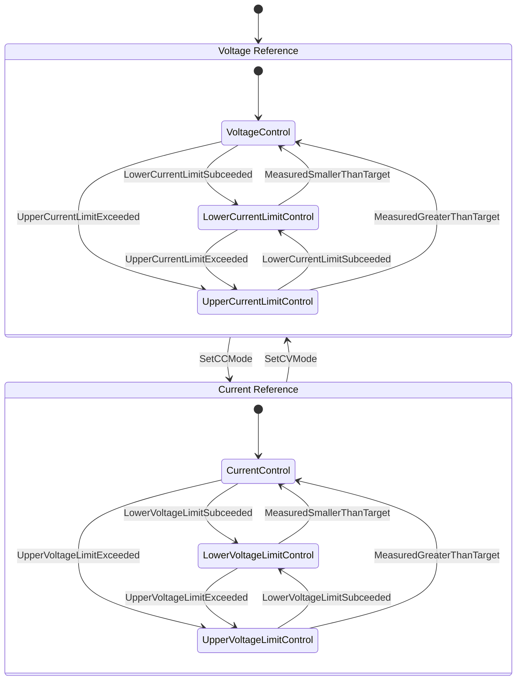

# State Machine

A limiting circuit is implemented based on a state machine as shown below. A
priority based approach to switching the limits is not chosen because it would
result in frequent switching between modes at limiting operation.

