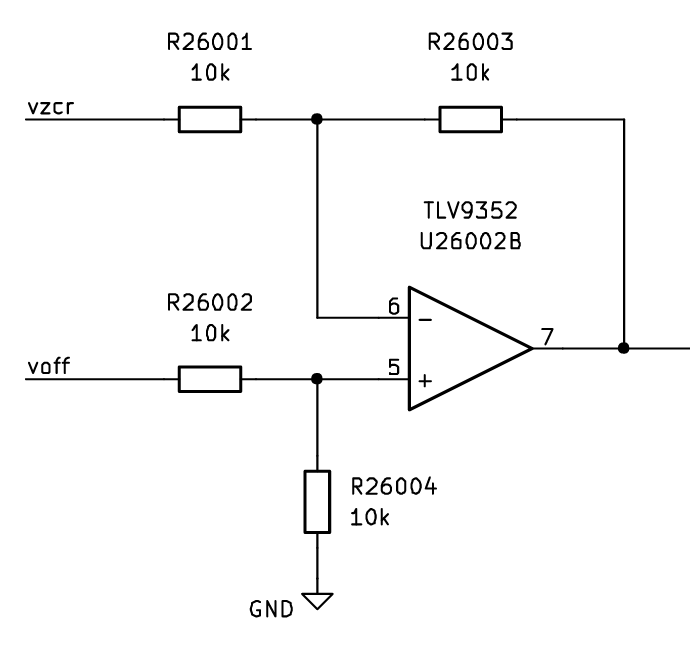
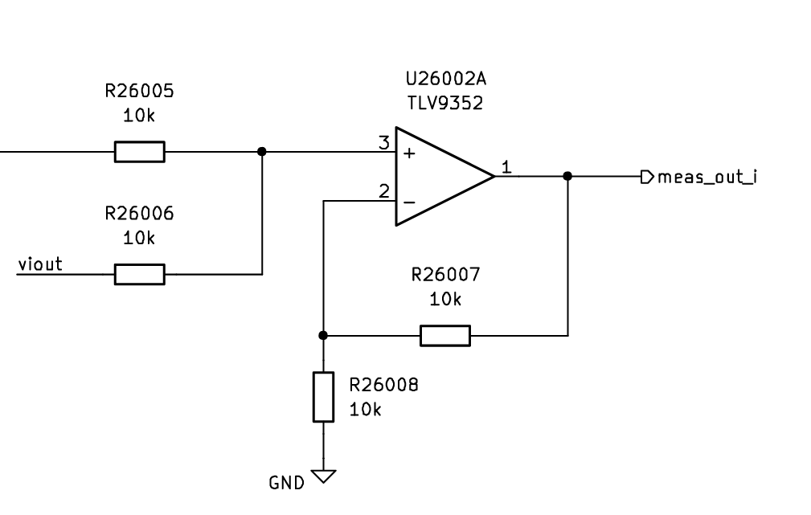
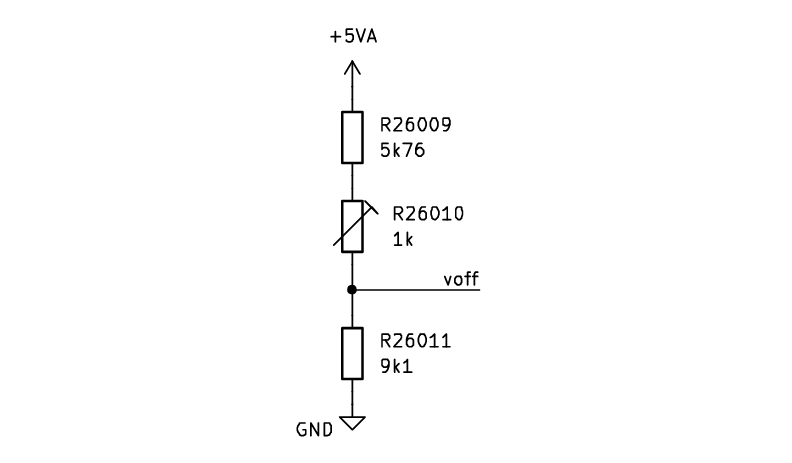

# Measurement

## Interface & Requirements

1. Voltage inputs
    - analog with $U \in [0V, 5V]$ with $R < 1 \Omega \forall |I| < 20A$
        - `in`, current input
2. Voltage output
    - analog with $U \in [0V, 5V]$ with $R < 1 \Omega \forall |I| < 20A$
        - `out`, current output
    - analog with $U \in [0V, 5V]$ with $R < 10 \Omega \forall I < 20mA$
        - `meas_out_v`, measured output voltage
        - `meas_out_i`, measured output current (flow: `in` $\arrow$ `out`)
          sensitivity: $100 \frac{mV}{A}$
3. Supply Voltages
    - $+10V$ @ $300mW$ ($30mA$)
    - $-5V$ @ $150mW$ ($30mA$)

## Circuit Selection and Design

The `measurement` sub circuit measures the output voltage and output current of
the powersupplysink and outputs an analog voltage signal from $0V$ to $5V$ for
the measured quantities.
The output voltage is scaled and the output current is transduced to a voltage.

### Circuit

#### Output Voltage Measurement

The output voltage is designed to be in the interval $[0V, 5V]$, therefore the
output voltage can be directly used by a galvanic connection, as a scaling
factor of $k = 1$ is required.

#### Output Current Measurement

The output current is measured by using a magnetic current sensor in an
integrated circuit. A shunt resistor can in theory also be used, but poses a
higher resistance in the path of flow of the current. Therefore to reduce the
power dissipation in the measurement sub circuit a magnetic current sensor is
preferred.

In order to get the correct voltage of $2.5V$ at zero current the current
sensor provides a reference voltage output, which is equal to the voltage at
zero current flow. To correct an offset, that might occur in comparison to the
reference used by the other sub circuits the following circuit is implemented
using addition and subtraction circuits with operational amplifiers. The
deviation can be caused by tolerance of the current sensor or tolerance of the
offset generation in the remaining powersupplysink.

$$ U_{meas\_out\_u} = U_{out,sensor} - U_{zeroRef,sensor} + U_{offset} \quad
\vert \quad U_{offset} = 2.5V $$

A difference amplifier is used to compute $V_{offset} - V_{zeroRef,sensor}
\approx 0V$, which should be as close to $0V$ as the deviation of the two
references.

The difference of the references is added to the sensor output $U_{out,sensor}$
by the application of a non-inverting summing amplifier.

The resistances used are chosen to be equal, which sets the weights of the
inputs to one and therefore only performs subtraction and addition.
The absolute value of the feedback resistance shall not be larger than the
cutoff frequency formed by the pole of the input capacitance and the feedback
resistance allows.

For a desired pole frequency of $f_{pole} \gtrapprox 3MHz$, which is larger
than the expected signal bandwidth of $f_{signal} = 1MHz$, and a parasitic
capacitance at the input of $C_{in} \approx 5pF$ the maximum resistance is
constrained by

$$ R < \frac{1}{2 \pi C_{in} f_{pole}} \approx 10.6 k \Omega $$

The minimum required output resistance of the current sensor is $R = 10 k
\Omega$. Therefore a resistance value of

$$ R = 10 k \Omega $$

can be selected for the addition and subtraction circuit.

#### Offset Voltage Generation

To generate the offset voltage of $\approx 2.5V$ a voltage divider can be used.
To allow manual tuning of the offset voltage to correct possible zero current
errors a trimmer is used to allow adjustment of the offset voltage.
A trimmer with $R = 1 k \Omega$ is already used and can be used a second time
to avoid requiring more distinct components.

Let $R_k \in [0 \Omega, 1k \Omega]$ be the resistance of the trimmer, and
$R_{in} = 20k \Omega$ the input resistance of the subtraction circuit. The
output voltage of the voltage divider can be calculated as:

$$ U_{offset}
= 5V \frac{R_{11} \parallel R_{in}}{R_{11} \parallel R_{in} + R_k + R_9} $$

By applying the constraints, that the trimmer shall allow a voltage adjustment
in the range of $U_{offset} \in [2.5V \pm 0.1V]$ the following equations can be
derived:

$$ U_{offset,upper}
= 5V \frac{R_{11} \parallel R_{in}}{R_{11} \parallel R_{in} + R_k + R_9}
= 5V \frac{R_{11} \parallel R_{in}}{R_{11} \parallel R_{in} + 0 \Omega + R_9}
= 2.6V
$$

$$ U_{offset,lower}
= 5V \frac{R_{11} \parallel R_{in}}{R_{11} \parallel R_{in} + R_k + R_9}
= 5V \frac{R_{11} \parallel R_{in}}{R_{11} \parallel R_{in} + 1k\Omega \Omega +
R_9} = 2.4V
$$

$$ \implies R_{9} \approx 5.76 k \Omega \quad \land \quad R_{11} \approx 9.1 k
\Omega $$

### Component Selection

#### Current Sensor

Current Sensors from _Allegro MicroSystems_ and _Texas Instruments_ are
considered, because of high market share and therefore projected long-term
availability of the component or successor components.

- Current Measurement Range: $I = \pm 20A \lor \pm 25A$
- Bandwidth $f_{BW} \geq 1 MHz$
- Supply Voltage $V \geq 5V$
- Preferred IC Package: SOIC
- For Allegro MicroSystems: Feature: _Zero Current Reference Voltage Output_

For Allegro MicroSystems_: [ACS730] Isolated Currrent Sensor can be used.

Alternatively in SOICW-16 package `CT430` and `CT432` may be used.
Texas Instruments offers only `TMCS1133A4A-Q1` with a $1MHz$ bandwidth, but the
sensor is not available at Mouser (15. Nov. 2024).

[ACS730]: https://mou.sr/3YOkQ98

#### Operational Amplifier

The opamp of the window comparator is reused to lower the amount of different
components in the design. It features a gain bandwidth product of $3.5MHz$,
which is enough for the signal with $1MHz$ bandwidth.
The slew rate is higher, than the slew rate of the current sensor.

[TLV9352](https://mou.sr/3BJsKZm)

- 2 or 4 channels
- SMD Mount, SOIC preferred
- rail-to-rail preferred
- $\text{SR} > 5V / \mu s$
- $V_{off} \leq 1mV$
- $I_{bias, in} \leq 1nA$ (To allow neglect of input current for high feedback resistance)
- $I_{out} \geq 20mA$
- Price sort on Mouser

#### Trimmer

The trimmer used in the `bias` sub circuit with $R=1k\Omega$ is reused to lower
the amount of different components.

## Simulation

TODO: link to simulation files

## Hardware tests in Laboratory

## Layout and Assembly Considerations

### PCB Layout

- Pull up/down for inputs, when stage is isolated, to run other tests.
TODO: Add test pins
TODO: Add (dic-)connector note, with testcase required for connecting

### Assembly

TODO: Add special hints for Assembly or remove

## Commissioning and Testing

TODO: add tests

### Testheading

Test ID: `v1.0.0/pss/control-logic/control/sign-propagation/<suffix>`

1. Connections
    - Output `out` disconnected
    - Input `meas` connected to $U_{meas} = 0V$
    - Input `ref` connected to $U_{ref} = +500mV$
2. Power on supply voltage
3. Wait for steady state $t_{wait} \gtrapprox 1ms$
4. Measure Voltages
    1. Error Signal (test id suffix: `error`)
        - Voltage at subtraction output $U_{e}$
    2. Output Signal (test id suffix: `output`)
        - Voltage at PID controller output $U_{out}$
5. Power off supply voltage
6. Test passed if
    1. Error Signal (test id suffix: `error`)
        - $U_{e} \in 500mV (1 \pm 10\%)$
    2. Output Signal (test id suffix: `output`)
        - $U_{out} \in 10V (1 \pm 10\%)$
