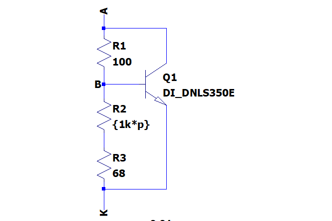

Bias Stage
==========

Bias and driver stage for the class AB output stage of the powersupplysink.

Interface & Requirements
------------------------

- Voltage Input
    - Voltage Input Swing $V_{in} \in [-2V, +6V] \subset [-3V, +8V]$
    - Input Current $| \pm I_{in} | \leq 20mA$
- Double voltage out with offset voltage
    - In phase with $V_{in}$
    - $V_{out-} \approx V_{in} - 0.6V + 1V = V_{in} + 0.4V$
    - $V_{out+} \approx V_{in} + 0.6V - 1V + V_{offset} = V_{in} + V_{offset} - 0.4V$
    - $V_{offset} \in [+0.73V, +1.8V]$
    - Output current $I_{out \pm} \geq \pm 800 mA$
- $V_{offset}$ adjustable via trimmer
- Supply Voltages
    - $+10V$ @ $7W$ ($700mA$)
    - $-5V$ @ $3.5W$ ($700mA$)

Circuit Selection and Design
----------------------------

### Literature Research for Available Options

Research in _Electronic Circuits_ by _Tietze, U. and Schenk, Ch._.[^1]
Chapter _15.2.3 Generation of Bias Voltage_ [^1] shows the following
possibilities to generate the bias voltages:

1. Bias voltage generation by diodes
    - symmetric
    - bias voltage fixed
    - low input impedance
    - rubber diode / VBE multiplier might be used instead of diodes
2. Bias voltage generation by transistors
    - symmetric
    - bias voltage fixed
    - high input impedance
    - rubber diode / VBE multiplier might be used additionally to increase bias
        voltage further to fixed value
3. Generation of a bias voltage that has an adjustable temperature coefficient
    - asymmetric
    - adjustable bias voltage (rubber diode / VBE multiplier)
    - temperature compensation possible
    - low input impedance

To reduce the required currents before the output current a transistor in common
collector circuit is used to reduced to boost the output current. Possibly
higher thermal dissipation is expected.
The current boost transistors can be driven by a circuit similar to (2.) with a
high input impedance. To achieve additional and adjustable offset voltage a
stage of (3.) can be preceded. With the modification of replacing the lower
current source of (3.) with a resistor an approximate idle point can be set
avoiding extreme outputs with high impedance input.

[^1]: 2008, Tietze, U. and Schenk, Ch.,
    "Electronic Circuits Handbook Design and Applications", Vol. 2,
    Springer-Verlag Berlin Heidelberg

### Overview

Overview of the used circuit.

### Current Boost Transistors

The Transistors $Q_3$ and $Q_4$ are referred to as the current boost transistors
and to reuse parts it is desired to reuse the already used parts _TIP41C_ and
_TIP42C_ from the outstage.

The critical condition of the current boost transistors is the dissipated power.
The maximum power is estimated in the worst case by a short connection of the
output through the outstage to the other voltage rail with maximum bias current.
Therefore the power will be
$$ P = U I = 10V 0.5A = 5W $$
Thus a heatsink with thermal resistance of $R_{th} < 15 K/W$ is required, which
can potentially be shared between the two transistors as they will not dissipate
the maximum power at the same time.

### Current Source Lowside

The required output current is approximately $500mA$, by $Q_4$ in the overview
image the current is boosted and there fore a smaller base current of $Q_4$ is
required. For a guaranteed $\beta_0 \ge 40$ of the transistors the base current
is $Q_{B4} = 500mA / 40 = 12.5mA$.
To drive the transistor $Q_2$ even at high current demand with a forward current
through the collector emitter path the current source is constructed to have
$$ I_{src} = 2 \cdot Q_{B4} = 25mA $$
To achieve the maximum voltage swing at the output with an $VBE_{Q4} \approx 1V$
the current source shall require only approximately $U_{src,min} = - U_{sup-} +
U_{out,min} + VBE_{Q4} = +5V -3V -1V = 1V$ of voltage drop to function.

When neglecting the collector emitter voltage of the current limiting transistor
the resistor $R_{3}$ can be calculated as follows to allow operation with a
voltage lower than $U_{src,min}$:
$$ R_{3} \lessapprox \frac{U_{src,min}}{I_{src}} \approx 47 \Omega $$
Trough simulation and optimization of the resistor value $R_3$ is determined
as:
$$ R_{3} = 33 \Omega $$

By using $VBE$ of the current limiting transistor the required base voltage of
the transistor can be set by a voltage divider with a total current of
approximately $2.5 mA$ for a negligible influence of the required base current
as:
$$ R_1 = 8.2k \Omega \quad \land \quad R_2 = 1k \Omega $$

### Current Source Highside

The highside current source is designed complementary to the lowside current
source and for the slighty changed VBE of the complementary transistor the
voltage divider is calculated as:
$$ R_1 = 8.2k \Omega \quad \land \quad R_2 = 1.2k \Omega $$

### Transistor Biasing

The biasing transistors $Q_1$ and $Q_2$ of the overview image can be reused from
the outstage as well. The cheaper and smaller SMD transistors _DNLS350E_ and
_DPLS350E_ can be chosen, as the maximum expected power is below
$$ P < (U_{SUP+} - U_{SUP-}) \cdot I_{src} = 375 mW $$

### Operational Point for High Impedance Input

$R_1$ in the overview image controls the operational point, when no input voltage
is supplied. For the current $25mA$ of the current source and a desired voltage
$U_{R1} = 2V$, which will approximately bias the output symmetrically around
$2.5V$ the resistor is calculated:
$$ R1 = \frac{U_{R1} - U_{sup-}}{I_{src}} = \frac{2V - (-5V)}{25mA} \approx 270
\Omega $$

### Rubber Diode / VBE Multiplier

The rubber diode shall be ajustable from VBE of the transistor to approximately
$1.8V$. Therefore a trimmer is selected to adjust the voltage drop. To avoid
excessive voltage drop in case of mechanical failure in the trimmer $R_2$ is
chosen to be adjustable.
For the two failure cases the following holds:

- $R_2 \to \infty$ the voltage drop of the rubber diode is reduced to the
    intrinsic _VBE_ of the transistor.
- $R_2 = 0 \Omega$ the voltage increases up to $v = \frac{U_{dropoff}}{VBE} =
    \frac{R_1}{R_3} + 1$. Therefore by chosing $R_3$ the maximum dropoff voltage
    can be set. At the cost of not being able to reach as low as _VBE_ during
    normal operation.

By reusing the transistor _DNLS350E_ from the outstage with $VBE(I_C=25mA) \approx 730mV$
the interval required for $v$ can be estimated.
To achieve $v \in [1.1, 2.5]$, with an $R_2 = 1k \Omega$ trimmer the following
equations can be used to derive the values for the resistors:
$$ v_{max} = 2.5 = \frac{R_1}{R_{2,min} + R_3} + 1 $$
$$ v_{min} = 1.1 = \frac{R_1}{R_{2,max} + R_3} + 1 $$
$$ R_{2,max} = 1k \Omega \quad \land \quad R_{2,min} = 0 \Omega $$
$$ \implies R_1 \approx 100 \Omega \quad \land \quad R_3 \approx 68 \Omega $$

Which satisfies:

- $I_{R2,max} \approx \frac{VBE}{R_{2,min} + R_3} = 10.7mA < 25mA$, which allows
    the transistor to stay in forward mode.
- $I_{R2,min} \approx \frac{VBE}{R_{2,max} + R_3} = 680 \mu A < 25mA$, which
    allows at the maximum offset voltage to still supply enough current to the
    base of the transistor.

### Component Selection

#### Current Boost Transistors

- 1x [TIP41C]
- 1x [TIP42C]

#### Current Boost Transistors Heatsink

Mouser Search: $R_{th} < 15 K/W$ (natural convection), In Stock, Sort by Price

- 2x [575002B00000G] Heatsink, Boardlevel
- 2x [A15037106] Phase Change Thermal Conductor
- 2x Screw M3
- 2x Spring Washer M3
- 2x Nut M3

#### Current Sources

- 3x [RC1210FR-078K2L], 8k2 1210
- 1x [RC1210FR-071KL], 1k 1210
- 2x [RC1210FR-071K2L], 1k2 1210
- 3x [RC1210FR-0733RL], 33 1210
- 1x [DNLS350], NPN SOT223
- 2x [DPLS350], PNP SOT223

#### Biasing Transistors

- 1x [DNLS350], NPN SOT223
- 1x [DPLS350], PNP SOT223

#### Operational Point Setting Resistor

- 1x [RC1210FR-07270RL], 270 1210

#### Rubber Diode / VBE Multiplier

- 1x [DNLS350], NPN SOT223
- 1x [RC1210FR-07680RL], 680 1210
- 1x [3362P-1-102RLF], 1k Trimmer

[TIP41C]: <https://mou.sr/3QXTwSz>
[TIP42C]: <https://mou.sr/3K8d0js>
[DNLS350]: <https://mou.sr/4c47rij>
[DPLS350]: <https://mou.sr/3KbWnUoY>
[575002B00000G]: <https://mou.sr/3V7xv6a>
[A15037106]: <https://mou.sr/4ak0pEy>
[3362P-1-102RLF]: <https://mou.sr/3UN76tb>
[RC1210FR-078K2L]: <https://mou.sr/3wyuvql>
[RC1210FR-071KL]: <https://mou.sr/3wyuvql>
[RC1210FR-071K2L]: <https://mou.sr/4bOvLUT>
[RC1210FR-0733RL]: <https://mou.sr/3V66hgr>
[RC1210FR-07270RL]: <https://mou.sr/4bM9JSN>
[RC1210FR-07680RL]: <https://mou.sr/3ysyLYV>

Simulation
----------

See `./*.asc` files. Simulations available for:

- current source highside
- current source lowside
- rubber diode
- bias circuit

Hardware tests in Laboratory
----------------------------

Layout and Assembly Considerations
----------------------------------

- Heatsink for current boost transistors can be shared.
- Add testpin for input and output
- Add disconnect option for input and outputs (solder bridge / jumper)

Commissioning and Testing
-------------------------

### Transfer Characteristic

Test ID: `v1.0.0/pss/bias/transfer/<suffix>`

1. Connect
    1. -2V (test id suffix: `-2V`)
        - Input $U_{IN} = -2V$
    2. 2V (test id suffix: `+2V`)
        - Input $U_{IN} = 2V$
    3. 6V (test id suffix: `+6V`)
        - Input $U_{IN} = 6V$
2. Turn offset trimmer to $R = 0 \Omega$, verify by measurement
3. Power on supply voltage
4. Measure Voltages
    1. Negative output voltage
        - Voltage at negative output $U_{out-}$
    2. Positive output voltage
        - Voltage at positive output $U_{out+}$
4. Power off supply voltage
5. Test passed if
    - $U_{IN} - 1V < U_{out-} < U_{IN} + 0.5V$
    - $U_{IN} + 0.5V < U_{out+} < U_{IN} + 2V$

### Offset Adjustment

Test ID: `v1.0.0/pss/bias/offset-adjust/<suffix>`

1. Connect
    - Input $U_{IN} = 2V$
2. Turn offset trimmer to $R = 0 \Omega$, verify by measurement
3. Power on supply voltage
4. Measure Output Voltages
    - Voltage at negative output $U_{out-,0}$
    - Voltage at positive output $U_{out+,0}$
5. Turn offset trimmer to $R = 1k \Omega$
6. Measure Output Voltages
    - Voltage at negative output $U_{out-,1}$
    - Voltage at positive output $U_{out+,1}$
7. Power off supply voltage
8. Test passed if
    - Let $U_{offset,0} = U_{out+,0} - U_{out-,0}$
    - Let $U_{offset,1} = U_{out+,1} - U_{out-,1}$
    - $U_{offset,0} + 0.5V < U_{offset,1} < U_{offset,0} + 1.5V$

