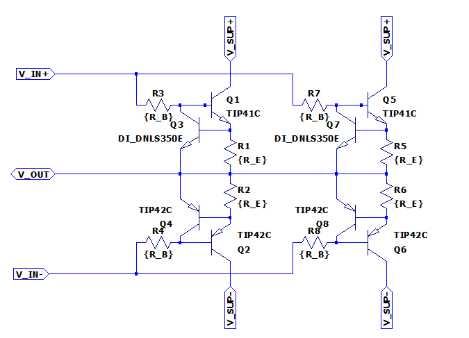

# Output Stage

Output stage class AB for driving the load of the powersupplysink.

## Interface & Requirements

1. Voltage Inputs
    - $I_{in} \approx 500mA < 1A \quad \forall \quad U_{out} \times I_{out}$
    - Voltage controlled input should be $V_{IN+} (t) = V_{IN-} (t) + V_{offset}
        \quad | V_{offset} \in \mathbb{R}_+$
        - `V_IN+`
        - `V_IN-`
        - $V_{offset} \approx 1V to 1.5V$ according to simulation for low crossover
            distortion operation.
        - Required input voltage swing: $V_{IN} \in [-3V, +8V]$
2. Voltage Output
    - $U_{out} \in [0V, +5V]$
    - $I_{out} \in [-20A, +20A]$
    - Short circuit I limit $| max(I_{out}) \leq |I_{max}| \leq |1.25 max(I_{out})|$
3. Supply Voltages
    - $+10V$ @ $250W$ ($25A$)
    - $-5V$ @ $125W$ ($25A$)

## Circuit Selection and Design

### Overview

Outstage Schematic Simulation with N2 parallel transistors, $n = 12$ is used for
total schematic.

### Transistor Technology Selection

To realize the power amplification complementary bjt transistors are chosen,
because

- their collector current can be controlled by the base current
- driving circuitry for FETs, IGBTs is more complex
- complementary parts are available to construct complementary emitter follower
    (push pull output stage)

### Transistor Type

With the specs it is possible to find parts like `MJ11032` and `MJ11033` as

- complementary
- darlington
- high current
- high power dissipation package TO−204 (TO−3)

transistors, that could maybe be used with high efforts for cooling. Still the
issue of scalability beyond 20A is not solved. In order to ease the requirements
on the thermal management multiple BJTs are connected in parallel to share the
load.

### Load Balancing & Short Circuit Protection

To achieve a balanced load distribution and avoid thermal runaway due to changes
of $V_{BE}$ emitter resistors are used for compensation. The voltage drop at the
emitter resistor can additionally be utilized to deploy short circuit protection
by current limiting. The current limit can be enforced by lowering the bias
currents when the voltage drop across the emitter resistors is exceeding a
predefined threshold.

#### Emitter (Ballast) Resistor

Considering a single npn transistor of the multiple paralleled transistors as
system $S$ the thermal evolution of the system can be approximated by:
$$ \frac{dQ}{dt} = P_{el} - P_{th} $$
The thermal power dissipation $P_{th}$ can be approximated from the stored
thermal energy $Q$ as follows:
$$ P_{th} \approx \frac{C_{th} Q}{R_{th}} = \frac{T}{R_{th}}  $$
Where $C_{th}$ is the thermal mass of the system $S$, $R_{th}$ is the thermal
resistance in $[\frac{K}{W}]$ and $T$ is the absolute temperature.
The delivered electrical power converted to thermal power in $S$ is described
by:
$$ P_{el} = U_{CE} I_{C} + U_{BE} I_{B} $$

The temperature coefficient $\gamma \quad [\frac{mV}{K}]$ of a given npn
transistor describes the change of $U_{BE}$ at a certain operating point for a
given temperature change, for constant $I_C$. [It is mainly derived from the
temperature dependence of the _reverse bias current_
$I_S$.](https://web.mit.edu/klund/www/Dphysics.pdf)
The electrical power can therefore be described depending on the temperature by:
$$
    I_B =
    \underbrace{
    \left[ I_S \exp \left( \frac{U_{BE} - \gamma \Delta T}{U_T} \right) \right]
    }_{I_B}
$$

$$
    P_{el} = I_B \left\{
    \underbrace{
        U_{BE} - \gamma \Delta T
    }_{U_{BE}} +
    \underbrace{
        \beta_0
    }_{I_{C}}
    \underbrace{
        \left( U_C - R_E (\beta_0 + 1) I_S \exp \left( \frac{U_{BE} - \gamma \Delta T}{U_T} \right) \right)
    }_{U_{CE}}
    \right\}
$$

Thermal runaway of the transistor is can be avoided by $\frac{dQ}{dt} = P_{el} -
P_{th} < 0$ and therefore:
$$
    R_E > \frac{1}{I_B} \left(
        U_C + \frac{U_{BE} - \gamma \Delta T}{\beta_0}
        - \frac{T}{R_{th}} \frac{1}{\beta_0 I_B} \right)
$$

For the worst case of $R_{th} \to \infty$ and with $U_C >> \frac{U_BE - \gamma
\Delta T}{\beta_0}$ and $(\beta_0 + 1) \approx \beta_0$ the expression can be simplified to:
$$
    R_E \gtrapprox \frac{U_C}{\beta_0^2 I_B} =
    \frac{U_C}{\beta_0^2 I_S \exp \left( \frac{U_{BE} - \gamma \Delta T}{U_T} \right)}
$$

For $U_C = 15V$, $\beta_0 = 25$, $I_S = 10^{-15} A$, $U_{BE} = 700 mV$, $U_T =
26mV$, $\Delta T = 100K$ and $\gamma = -2 \frac{mV}{K}$ the constrained for the
ballast resistor is
$$ R_E \gtrapprox 22 m \Omega $$

!!! info
    The thermal voltage $U_T$ is not temperature independent as assumed in this
    calculation. The effect of the thermal voltage change on the base current is
    rather small compared to the effect of $\gamma$. Additionally the thermal
    voltage is increased with temperature reducing the base current thus the
    effect counteracts the thermal runaway. Therefore when neglected the
    inequality constraint is not violated.

The selected current limiting transistor of the short circuit protection
`DNLS350` has an base-emitter turn on voltage
$$ V_{BE,on} \approx 700mV | I_{C} = 300mA, T = 25°C $$
$$ V_{BE,on} \approx 600mV | I_{C} = 300mA, T = 85°C $$

Therefore the range of the ballast resistor is further restricted by

1. A minimum value which is required to still limit the current below the
   allowed $I_{max} / n$ even at room temperature, where $n = 12$ is the number
   of used power transistors paralleled.
   $$ R_E > \frac{700mV}{25A / 12} = 330 m \Omega $$
2. A maximum value which is must not be exceeded to allow the nominal current
   flow $I_{out} / n$ even at high temperature, where $n = 12$ is the number of
   used power transistors paralleled.
   $$ R_E < \frac{600mV}{20A / 12} = 360 m \Omega $$

The power rating of the resistor shall be
$$ P_{RE} = \frac{I_{max}}{n}^2 \cdot R_E $$
or better. In the case of the ballast resistor being limited by the nominal
current flow at low $V_{BE,on}$ this would be:
$$ P_{RE} > \frac{25A}{12}^2 \cdot 360m \Omega \approx 1.6 W $$

#### Short Circuit Protection

To limit the current in case of a short circuit a current limiting transistor
can be connected from the base of each power transistor over the ballast
resistor. When the voltage across the ballast resistor $U_{RE}$ rises to
$U_{BE}$ of the limiting transistor the base current of the power transistor
will be limited. The current limiting is applied separately for each power
transistor.

The base resistor $R_B$ cannot exceed a certain resistance, because it will
increase the input resistance until the preceeding stage cannot drive enough
current into the base of the power transistors.

For an expected maximum voltage $U_{in,max} = U_{SUP+} - 2V = 8V$ of the
preceeding stage the maximum tolerable $R_B$ is for an maximum required base
current $I_{b,pwr} = I_{out,max} / n / \beta_0$ of the power transistor.
$$
    R_B < \frac{U_{in,max} - U_{outmax} - 2* U_{BE,on}}{I_{b,pwr}} =
    \frac{8V - 2 \cdot 1V - 5V}{\frac{20A}{12 \cdot 40}} \approx 24 \Omega \\
$$

By using $R_B$ from E12, it can be chosen.
$$
    R_B = 22 \Omega
$$

The maximum collector current of the $I_{C,lmt}$ of the current limiting
transistor can be calculated depending on the collector voltage $U_{C,lmt} =
U_{B,pwr}$.
$$ I_{C,lmt} = \frac{U_{in,max} - U_{C,lmt}}{R_B} - I_{b,pwr} $$
$$ U_{in,max} \leq 8V \quad \wedge \quad U_{C,lmt} > 2 \cdot U_{BE,on} $$
$$ \implies I_{C,lmt} \leq \frac{8V - 2 \cdot 1V}{22 \Omega} - \frac{20A}{12
\cdot 40} \approx 230mA $$

The thermal power requirement on the limiting transisor can be approximated by
neglecting base current and base-emitter voltage as follows.
$$ P_{lmt} \approx I_{C,lmt} \cdot U_{C,lmt} = - \frac{1}{R_B} U_{C,lmt}^2 +
(\frac{U_{in,max}}{R_B} - I_{b,pwr}) U_{C,lmt}$$
With $$ \frac{\partial P_{lmt}}{\partial U_{C,lmt}} = 0 \implies U_{C,lmt} = 3.56 V$$ the $U_{C,lmt}$ for
maximum power dissipation in the limiting transistor can be found from which the
maximum power dissipation in the limiting transistor can be calculated:
$$ P_{lmt} < I_{C,lmt}(3.56V) \cdot 3.56V \approx 580mW $$

### Thermal Resistance Consideration

The current and thermal load distribution are the factors significantly
influencing the multiplicity of paralleled transistors. As it is expected that
thermal load will be more restrictive than current load, the multiplicity is
derived using the thermal characteristics. From the multiplicity a requirement
for component selection regarding the maximum current capability is established.
From that a complementary bjt pair is selected to fulfill the requirements.

The biggest thermal active power is achieved at highest voltage drop and highest
current through the device $P = U I$. The maximum voltage drop and current of
the transistors is achieved with a short circuit of the output.

- Short circuit to $0V$: maximum power dissipation in npn transistors for power
    delivery (operational in first quadrant, supply of electrical power)
- Short circuit to $5V$: maximum power dissipation in pnp transistors for power
    consumption (operational in second quadrant, sink of electrical power)

Because the supply voltages are respectively $5V$ higher or lower than the
limits and the sourced and sunk currents are symmetrical both power dissipation
cases can be treated equal. The following calculations are conducted for the npn
transistors with a short circuit to $0V$. The maximum voltages are limited by
the available voltage of the power supply rails. The following ESD and
protection circuitry also guarantees, that a short circuit will not be able to
imprint voltages outside of the operational interval of $[0V, 5V]$ to the
output.
Similarly the maximum current is enforced by the short circuit protection of
this output stage. The current limit of this output stage is determining the
maximum current, even in case of failure of preceding circuitry.

The maximum thermal power dissipation due to output current is approximated by:
$$ P_{th,max} = U I = (U_{supply} - U_{sc}) I_{max}\
= (10V - 0V) 1.25 \cdot 20A = 250W $$

This approximation is an upper bound for the power dissipation including

- the thermal dissipation by the control voltage and current at the base, in
    case the base current is also limited by the current limiting circuitry.
    That is the case for the short circuit protection utilizing the voltage drop
    across the emitter resistors, because $I_E = I_C + I_B$ holds.  If a
    limiting transistor is used to bypass excess base current this limiting
    transistor must rendered inoperable before the thermal dissipation of the
    output stage transistors is exceeded. It is assumed that the preceding stage
    does not deliver enough power to thermally destroy the current limiting
    transistors, while completely delivering additionally the entire short
    circuit current $I_{max}$. Destruction of the preceding stage is likely
    before the thermal power dissipation limit for the output stage transistors
    is exceeded.
- the quiescent current. The quiescent current is also contributing to the
    limited current $I_{max}$, as it flows from the collector to the emitter.

#### Combination of Heatsinks

Because the worst case conditions for the npn and pnp transistors can only occur
exclusively the transistors can share one combined heatsink with unchanged
thermal requirements.
This requires the assumption, that the preceding stage does not allow excess
quiescent current to flow.

#### Package Selection

To reduce the number of devices needed the thermal resistance should be low.
Therefore only selected well established packages are compared.
The values for thermal resistance are retrieved from _ROHM Co., Ltd_ [^1] unless
noted otherwise.

| Package            | Technology | $R_{th,JA} [K/W]$ | $R_{th,JC} [K/W]$ |
|:-------------------|:-----------|:------------------|:------------------|
| TO-220AB           | THT        | 80                | 0.8               |
| TO-247             | THT        | 30                | 0.6               |
| TO-204 (TO-3) [^2] | THT        | 30                | 0.8               |
| TO-252 (DPAK)      | SMD        | 147               | 4.9               |
| TO-263 (D2PAK)     | SMD        | 80                | 4.2               |
| HSOP8              | SMD        | 41.7              | 5.6               |

!!! info
    Expected thermal resistance for case to heatsink with thermal grease and
    electrical isolation $R_{th,CH} \approx 1 K/W$.
    Heatsinks in extruded profile shape (ger. Strangkühlkörper) can provide
    approximately $R_{th,HA} \approx 1K/W ... 3K/W$ for our use case. [^3]

[^1]: [2023, ROHM Co., Ltd.,
    "List of Transistor Package Thermal Resistance",
    accessed at 06.04.2024][thermal-res]

[^2]: [2021, Hunter, G.,
    "TO-3 Component Package",
    accessed at 07.04.2024][thermal-res-to3]

[^3]: <https://www.fischerelektronik.de/service/kataloge-up-to-date/>

[thermal-res]: https://rohmfs-rohm-com-cn.oss-cn-shanghai.aliyuncs.com/en/products/databook/applinote/common/list_of_transistor_package_thermal_resistance_an-e.pdf
[thermal-res-to3]: https://blog.mbedded.ninja/pcb-design/component-packages/to-3-component-package/

If at an ambient temperature of $40°C$ the maximum desired junction temperature
is considered to be $100°C$ (lifespan), a maximum temperature difference of
$T_{diff} = T_{j,max} - T_{a,max} = 100°C - 40°C = 60K$ is estimated.
For cooling without a heatsink this would imply a lower bound of the
multiplicity of paralleled transistors of:
$$ n_{th,JA} \ge \frac{P_{th,max} R_{th,JA}}{T_{diff}} $$

With $min(R_{th,JA}) = 30 K/W$ in the case of `TO-247` packages this yields an
uneconomical high number of required components:
$$ n_{th,JA} \ge \frac{250W \cdot 30K/W}{60K} = 125 $$

To reduce the number of required components a heatsink will be employed. For the
most conductive SMD package `TO-263 (D2PAK)` even with an ideal heatsink
$R_{th,CA} = 0 K/W$ to the PCB the number of required packages is:
$$ n_{th,TO-263} \ge \frac{P_{th,max} (R_{th,JC} + R_{th,CA})}{T_{diff}}\
= \frac{250W \cdot (4.2K/W + 0K/W)}{60K} = 17.5 $$
For the real application dissipating 250W into the PCB will yield high thermal
stress and require a significant area on the PCB. Therefore one of the THT
mounted packages is preferred. With an ideal heatsink the number of components
is:
$$ n_{th,TO220AB} \ge \frac{250W \cdot (0.8K/W + 0K/W)}{60K} \approx 3.3 $$
$$ n_{th,TO247} \ge \frac{250W \cdot (0.6K/W + 0K/W)}{60K} = 2.5 $$
$$ n_{th,TO204} \ge \frac{250W \cdot (0.8K/W + 0K/W)}{60K} \approx 3.3 $$

### Component Selection

#### Complementary Power Transistors

*Search on Mouser with filters*

- $I_{C,max} > 4 A$
- $V_{CE,max} > 20 V$
- $P_{tot} > 30 W$
- THT-Package

*Procedure*

- Get data from datasheet
- Calculate the power which can be dissipated $P_{real} [W]$ at
    - $R_{CA} = 2.4 K/W$, ($0.4 K/W$ from isolation `WS 220`, $2 K/W$ from `SK662 200`)
    - $T_{J,safety} = 30K$
    - $T_{amb} = 25°C$
- Get sensible collector current $I_{C,real} [A]$ and corresponding dc gain $\beta_0$ from datasheet
- Calculate minimum number of required components (NPN and PNP) with
    - $n = 2 \cdot \max ( \lceil P_{th,max} / P_{real} \rceil, \lceil I_{max} / I_{C,real} \rceil)$
- Calculate the total price $\text{Price total} = n \cdot \text{Price p. unit}$

*Result*

See table below with results, which are exported from excel.

- _BD433/5/7, BD434/6/8_ is rejected in favor of a _TO-220_ package, because for
    high number of components it is easier to mount.
- _MJE3055T, MJE2955T_ is rejected in favor of _TIP42C, TIP42C_, because the
    price for the complementary part is higher with approx 1 Eur than visible in
    the list.

- _TIP41C, TIP42C_ is favored for the design.

| Part Number                                                                            | Package | $T_{J,max} [°C]$ | $P_{tot} [W]$ | $P_{real} [W]$   | $I_{C,max} [A]$ | $I_{C,real} [A]$ | $\beta_0$ | $I_{B,total} [A]$ | $U_{BE,on} [V]$ | $n$ | $\text{Price p. unit} [Eur]$ | $\text{Price total} [Eur]$ |
|:---------------------------------------------------------------------------------------|---------|------------------|---------------|------------------|-----------------|------------------|-----------|-------------------|-----------------|-----|------------------------------|----------------------------|
| [MJE3055T, MJE2955T](https://www.mouser.de/datasheet/2/308/1/MJE2955T_D-2315820.pdf)   | TO-220  | 150              | 75            | 23.3606557377049 | 10              | 4                | 20        | 1                 | 1.8             | 22  | 0.69                         | 15.18                      |
| [BD433/5/7, BD434/6/8](https://www.mouser.de/datasheet/2/389/bd437-1848935.pdf)        | SOT-32  | 150              | 36            | 16.1             | 4               | 2                | 40        | 0.5               | 1.2             | 32  | 0.502                        | 16.064                     |
| [TIP41C, TIP42C](https://www.mouser.de/datasheet/2/389/tip41c-1852274.pdf)             | TO-220  | 150              | 65            | 21.9             | 6               | 4                | 30        | 0.6               | 2               | 24  | 0.72                         | 17.28                      |
| [2N5191G, 2N5194](https://www.mouser.de/datasheet/2/308/2N5191_D-2309067.pdf)          | TO-225  | 150              | 40            | 17.1             | 4               | 2                | 20        | 1                 | 1.2             | 30  | 0.577                        | 17.31                      |
| [D44VH10, D45VH10](https://www.mouser.de/datasheet/2/308/1/D44VH_D-2310858.pdf)        | TO-220  | 150              | 83            | 24.3             | 15              | 4                | 20        | 1                 | 1.2             | 22  | 0.83                         | 18.26                      |
| [D44H8, D45H8](https://www.mouser.de/datasheet/2/389/d44h8-1848919.pdf)                | TO-220  | 150              | 50            | 19.3             | 10              | 4                | 40        | 0.5               | 1.5             | 26  | 0.772                        | 20.072                     |
| [TIP35CW, TIP36CW](https://www.mouser.de/datasheet/2/389/tip35cw-1852306.pdf)          | TO-247  | 150              | 125           | 27.9             | 25              | 3                | 30        | 0.6               | 2               | 18  | 1.87                         | 33.66                      |
| [NJW3281G, NJW1302G](https://www.mouser.de/datasheet/2/308/1/NJW3281_D-2318020.pdf)    | TO-3P   | 150              | 200           | 31.4             | 15              | 8                | 45        | 0.4               | 1.5             | 16  | 3.65                         | 58.4                       |
| [MJW21196, MJW21195](https://www.mouser.de/datasheet/2/308/1/MJW21195_D-2315975.pdf)   | TO-247  | 150              | 200           | 31.4             | 16              | 8                | 20        | 1                 | 2               | 16  | 4.11                         | 65.76                      |
| [MJ15022, MJ15023](https://www.mouser.de/datasheet/2/308/1/MJ15022_D-2316114.pdf)      | TO-3    | 200              | 250           | 46.7             | 16              | 10               | 15        | 1.3               | 2.2             | 12  | 6.29                         | 75.48                      |
| [MJW21194, MJW21193](https://www.mouser.de/datasheet/2/308/1/MJW21193_D-2315789.pdf)   | TO-247  | 150              | 200           | 31.4             | 16              | 8                | 20        | 1                 | 2.2             | 16  | 4.81                         | 76.96                      |
| [MJL21196, MJL21195](https://www.mouser.de/datasheet/2/308/1/MJL21195_D-2316291.pdf)   | TO-264  | 150              | 200           | 31.4             | 16              | 8                | 25        | 0.8               | 2.2             | 16  | 4.9                          | 78.4                       |
| [MJ802, MJ4502G](https://www.mouser.de/datasheet/2/308/1/MJ4502_D-2316036.pdf)         | TO-3    | 200              | 200           | 44.2             | 30              | 7.5              | 25        | 0.8               | 1.3             | 12  | 7.43                         | 89.16                      |
| [MJL4281AG, MJL4302AG](https://www.mouser.de/datasheet/2/308/1/MJL4281A_D-2315934.pdf) | TO-264  | 150              | 230           | 32.2             | 15              | 8                | 50        | 0.4               | 1.5             | 16  | 5.59                         | 89.44                      |

#### Heatsink

The heatsink is searched in catalogue of company _Fischer Elektronik_.

- Low thermal resistance $R_{th} < 4 K/W$, smaller is better as it reduces cost
    by not needing more transistors.
- Mounting style, clip mounting for assembly of heatsink after soldering and
    easier repair.
- "Double sided mounting" at PCB for reduction of size. (PNP and NPN can be
    mounted on same heatsink)

*Result*

- 2x `SK499 120` available at [AudioTube](https://www.audiotube24.de/product_id-00017850)
- 30x [THFU2](https://www.audiotube24.de/product_id-00017487) Clip
- 30x [Silicon Insulator](https://mou.sr/3K4ou7F)
- Fan for forced convection: <https://mou.sr/3yeFHsr>

Alternatives:

- 2x `SK662 100` with $2 K/W$
- 2x `SK593 100` with $2 K/W$ (bigger)
- `SK50` (mounting with custom CNC, probably expensive)

Mounting clip: `THFU 2`
Isolation washer: `WS 220`

#### Current Limiting Transistor

*Search on Mouser with filters*

- $I_{C,max} > 2 A$
- $P_{tot} > 1 W$
- Sort by price ascending
- Check that complementary type is available

*Results*

| Part. No               | Package | Info                                                          |
|------------------------|---------|---------------------------------------------------------------|
| [DNLS350, DPLS350E]    | SOT223  | Provides the desired performance for low price                |
| [PBSS4350X, PBSS5350X] | SOT89   | Power dissipation, critical for SOT89, big footprint required |
| [PBSS5350D, PBSS4350D] | SOT4547 | Power dissipation to high                                     |

Select [DNLS350, DPLS350E] for easier thermal management in favor of the other
options.

[DNLS350, DPLS350E]: <https://www.diodes.com/assets/Datasheets/ds31231.pdf>
[PBSS4350X, PBSS5350X]: <https://www.mouser.de/datasheet/2/916/PBSS4350X-2938389.pdf>
[PBSS5350D, PBSS4350D]: <https://www.mouser.de/datasheet/2/916/PBSS5350D-2909976.pdf>

#### Ballast Resistor

*Search on Mouser*

To achieve $R_E \approx 330 m \Omega$ with $P_{RE} = 3W >> 1.6 W$ the following
options have been found through mouser search:

| Part. No.    | Resistance $[m \Omega]$ | Power Rating $[W]$ | Price p. P. [Eur] |
|--------------|-------------------------|--------------------|-------------------|
| [RR03JR33TB] | 330                     | 3                  | 0.157             |
| [RR02JR68TB] | 680                     | 2                  | 0.14              |

*Result*

[RR02JR68TB]

While the _RR03JR33TB_ is cheaper in total, because only one component is
required per transistor except two as for _RR02JR68TB_, _RR02JR68TB_ is
preferred as for the parallel expected value $R = 680 / 2 m \Omega$ is expected
to be better in the desired range of $330 m \Omega$ to $350 m \Omega$, when the
tolerance is also of concern. For quantities $100$ or bigger the price drops
also to $0.07 Eur$.

[RR03JR33TB]: <https://www.mouser.de/ProductDetail/TE-Connectivity-Holsworthy/RR03JR33TB?qs=sGAEpiMZZMtlubZbdhIBIL1jfe5%2FyPTLGVSKJynZY2s%3D>
[RR02JR68TB]: <https://www.mouser.de/ProductDetail/TE-Connectivity-Holsworthy/RR02JR68TB?qs=sGAEpiMZZMtlubZbdhIBIJxdTG9LhrplYzQM53Fdd2M%3D>

#### Base Resistor

The base resistor faces voltage drop up to $6V$ therefore its power rating
should be $P >> (6V)^2 / 22 \Omega \approx 1.6 W$.

*Search*

Searching on Mouser for:

- $R = 22 \Omega$
- $P > 3W$

*Result*

[RR03J22RTB] for $0.157 Eur p. P.$

[RR03J22RTB]: <https://www.mouser.de/ProductDetail/TE-Connectivity-Holsworthy/RR03J22RTB?qs=sGAEpiMZZMtlubZbdhIBIIenWIH7rhEv%252B4gI1ku6TGs%3D>

## Simulation

See `./outstage.asc` and `./outstage.asy`.

## Hardware tests in Laboratory

## Layout and Assembly Considerations

### PCB Layout

- Add testpins for ballast resistor voltage measurement (measurement)
- Add testpins for input voltages (measurement, test source)
- Add testpin for output (measurement, load) [^4]
- Current limiting Transistor footprint, include bigger pad as thermal relieve
- Pull up/down for inputs, when stage is isolated, to run other tests.

[^4]: Screw terminal can be used for up to $|I| = 20 A$

### Assembly

- The power transistors should be mounted thermally coupled on the same heatsink
    to reduce thermal drift of individual transistors.
- Additionally one heatsink can be shared by the npn and pnp power transistor,
    because they are not subject to simultaneous heating.
- Apply thermal grease and electrical insulation from transistors to heatsink.

## Commissioning and Testing

### Load Distribution

Test ID: `v1.0.0/pss/power-electronics/outstage/load-distribution/<suffix>`

1. Connect
    1. Positive Rail (test id suffix: `positive`)
        - Output with $R = 100 m \Omega$ to _GND_ ($P = 10W$)
        - positive Input $U_{IN+} = 2V$
        - negative Input $U_{IN-} = 0V$
    2. Negative Rail (test id suffix: `negative`)
        - Output with $R = 100 m \Omega$ to _GND_ ($P = 10W$)
        - positive Input $U_{IN+} = 0V$
        - negative Input $U_{IN-} = -2V$
2. Power on supply voltage
3. Measure Voltages
    1. Positive Rail
        - Voltage across positive ballast resistors $U_{RE+}$
    2. Negative Rail
        - Voltage across negative ballast resistors $U_{RE-}$
4. Power off supply voltage
5. Test passed if
    - $U_{RE} \neq 0V \quad \wedge \quad U_{RE} \in \overline{U_{RE}} ( 1 \pm 10 \%) \quad \forall \quad U_{RE}$

### Short Circuit Test

Test ID: `v1.0.0/pss/power-electronics/outstage/short-circuit/<suffix>`

1. Connect
    1. Positive Rail (test id suffix: `positive`)
        - Output with $R \to 0 \Omega$ to _GND_ ($I = 20A$)
        - positive Input $U_{IN+} = 2V$
        - negative Input $U_{IN-} = 0V$
    2. Negative Rail (test id suffix: `negative`)
        - Output with $R \to 0 \Omega$ to _5V_ ($I = 20A$)
        - positive Input $U_{IN+} = 0V$
        - negative Input $U_{IN-} = -2V$
2. Power on supply voltage
3. Measure
    1. Positive Rail
        - Voltage across positive ballast resistors $U_{RE+}$
        - Output current $I_{Output}$
    2. Negative Rail
        - Voltage across negative ballast resistors $U_{RE-}$
        - Output current $I_{Output}$
4. Power off supply voltage
    - $U_{RE} \neq 0V \quad \wedge \quad U_{RE} \in \overline{U_{RE}} ( 1 \pm 10 \%) \quad \forall \quad U_{RE}$
    - $20A \leq |I_{Output}| \leq 25 A$
