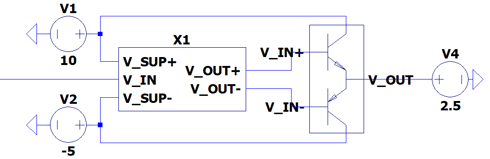

# Power Electronics

## Interface & Requirements

1. Voltage inputs
    - Voltage Input Swing $V_{in} \in [-2V, +6V] \subset [-3V, +8V]$
    - Input Current $| \pm I_{in} | \leq 20mA$
2. Voltage output
    - $U_{out} \in [0V, +5V]$
    - $I_{out} \in [-20A, +20A]$
    - Short circuit I limit $| max(I_{out}) \leq |I_{max}| \leq |1.25 max(I_{out})|$
3. Supply Voltages
    - $+10V$ @ $257W$ ($25.7A$)
    - $-5V$ @ $128.5W$ ($25.7A$)

## Circuit Selection and Design

### Circuit

The `power-electronics` sub circuit is the combination of the `bias` and
`outstage` sub circuit in series.

### Component Selection

The sub circuits are designed to work together. The dual inputs with offset are
produced by the bias stage, which also sets the quiescent current through the
outstage.

## Simulation

Simulation example can be found in `./sim_power-electronics.asc`.
hierarchical simulation block is available as `./power-electronics.asc` and
`./power-electronics.asy`.

## Hardware Tests in Laboratory

## Layout and Assembly Considerations

### PCB Layout

- Pull up/down for inputs, when stage is isolated, to run other tests.
- (Dis-) connector between _bias_ and _outstage_, (solderbridge / jumper)
    Label with testname hint

### Assembly

## Commissioning and Testing

1. Pass all tests for _bias_
2. Pass all tests for _outstage_
3. Connect _bias_ and _outstage_
4. Set Offset adjustment trimmer of _bias_ to $R = 0 \Omega$, verify by
   measurement
5. Connect _bias_ input to $U_{in} = 2V$
6. Power on supply voltage
7. Measure $U_{out}$ of _outstage_ and adjust $U_{in}$ until $U_{out} \approx
   2.5V$
8. Adjust offset adjusment trimmer of _bias_ until ballast resistor current of
   _outstage_ is $\approx 20mA$.
   Therefore measure voltage across a single ballast resistor and calculate $I =
   U/R$
9. Power off supply voltage

### Transfer

Test ID: `v1.0.0/pss/power-electronics/transfer/`

1. Connections
    - Input connected to $U_{1,in} = 2V$
2. Power on supply voltage
3. Measure Voltages
    - Output voltage $U_1$
4. Change input voltage to $U_{2,in} = 3V$
5. Measure Voltages
    - Output voltage $U_2$
6. Power off supply voltage
7. Test passed if
    - $U_2 - U_1 \in (U_{2,in} - U_{1,in}) \cdot (1 \pm 5%)$
