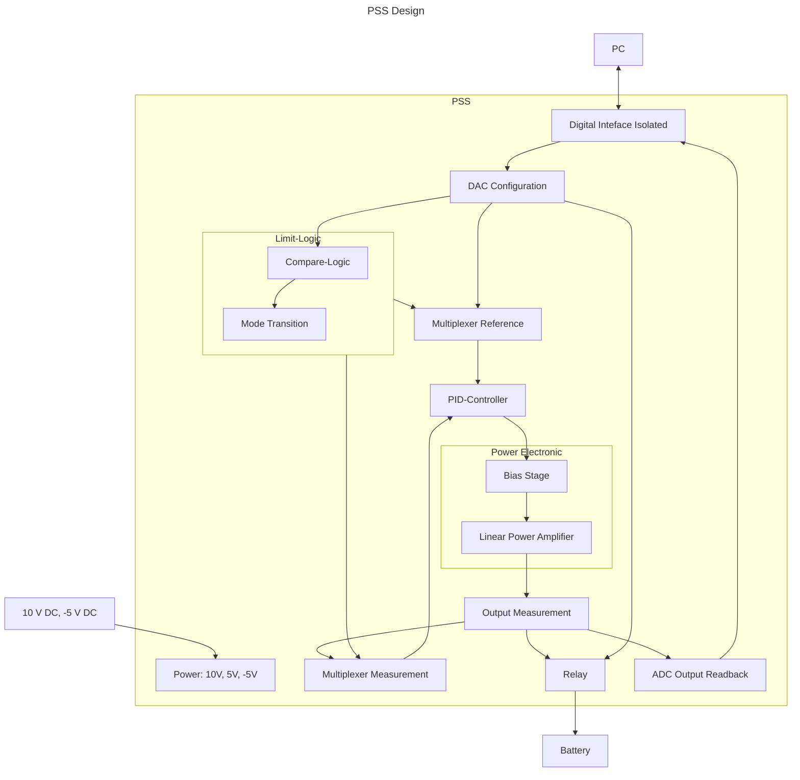

# Power Supply Sink

The Power Supply Sink is controlled from the PC via a programmable bus interface
to set the desired voltage, current or power.

## Block Diagram

```mermaid
---
title: PSS Design
---
flowchart TB
pc[PC]
ext_power[10 V DC, -5 V DC]
bat[Battery]

subgraph pss[PSS]
    direction TB

    power[Power: 10V, 5V, -5V]
    dig_interface[Digital Inteface Isolated]
    conf[DAC Configuration]
    direction LR
    mux_ref[Multiplexer Reference]
    control[PID-Controller]
    subgraph pe[Power Electronic]
        bias[Bias Stage]
        outstage[Linear Power Amplifier]
    end
    meas[Output Measurement]
    mux_meas[Multiplexer Measurement]
    relay[Relay]

    subgraph limit[Limit-Logic]
        comp[Compare-Logic]
        mode-tran[Mode Transition]
    end

    adc[ADC Output Readback]
end

ext_power --> power
pc <--> dig_interface --> conf
meas --> adc --> dig_interface
conf --> mux_ref --> control --> bias --> outstage --> meas --> relay --> bat
meas --> mux_meas --> control
conf --> comp --> mode-tran
limit --> mux_meas
limit --> mux_ref
conf --> relay
```
