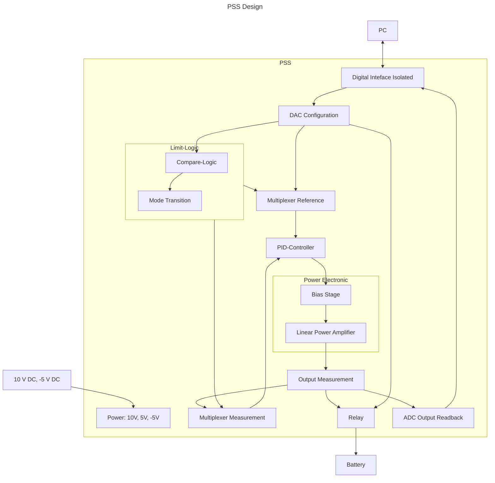

# Power Supply Sink

The Power Supply Sink is controlled from the PC via a programmable bus interface
to set the desired voltage, current or power.

## Interface & Requirements

TODO: Add Input specs
TODO: Add Output specs

1. Voltage inputs
    - analog with $U \in [0V, 5V]$ with $R < 100 \Omega \forall I < 1mA$
    - analog with $U \in [0V, 5V]$ with $R < 100 \Omega \forall I < 20mA$
    - digital positive logic with $U \in [-5V, 10V]$, driving up to $I = 1 mA$
    load
2. Voltage output
    - analog with $U \in [0V, 5V]$ with $R < 100 \Omega \forall I < 1mA$
    - analog with $U \in [0V, 5V]$ with $R < 100 \Omega \forall I < 20mA$
    - digital positive logic with $U \in [-5V, 10V]$, driving up to $I = 1 mA$
    load
3. Supply Voltages
    - $+10V$ @ $260W$ ($26A$)
    - $-5V$ @ $180W$ ($26A$)

!!! warning "Supply Voltages"
    In order to achieve galvanic isolation the provided supply voltages must
    provide galvanic isolation. The `pss` output voltage is *not* isolated
    internally.

## Circuit Selection and Design

### Circuit

TODO: Add circuit description

#### Block Diagram

### Component Selection

TODO: Add component selection

## Simulation

TODO: link to simulation files

## Hardware tests in Laboratory

## Layout and Assembly Considerations

### PCB Layout

- Pull up/down for inputs, when stage is isolated, to run other tests.
TODO: Add test pins
TODO: Add (dic-)connector note, with testcase required for connecting

### Assembly

TODO: Add special hints for Assembly or remove

## Commissioning and Testing

TODO: add tests

### Testheading

Test ID: `v1.0.0/pss/control-logic/control/sign-propagation/<suffix>`

1. Connections
    - Output `out` disconnected
    - Input `meas` connected to $U_{meas} = 0V$
    - Input `ref` connected to $U_{ref} = +500mV$
2. Power on supply voltage
3. Wait for steady state $t_{wait} \gtrapprox 1ms$
4. Measure Voltages
    1. Error Signal (test id suffix: `error`)
        - Voltage at subtraction output $U_{e}$
    2. Output Signal (test id suffix: `output`)
        - Voltage at PID controller output $U_{out}$
5. Power off supply voltage
6. Test passed if
    1. Error Signal (test id suffix: `error`)
        - $U_{e} \in 500mV (1 \pm 10\%)$
    2. Output Signal (test id suffix: `output`)
        - $U_{out} \in 10V (1 \pm 10\%)$
