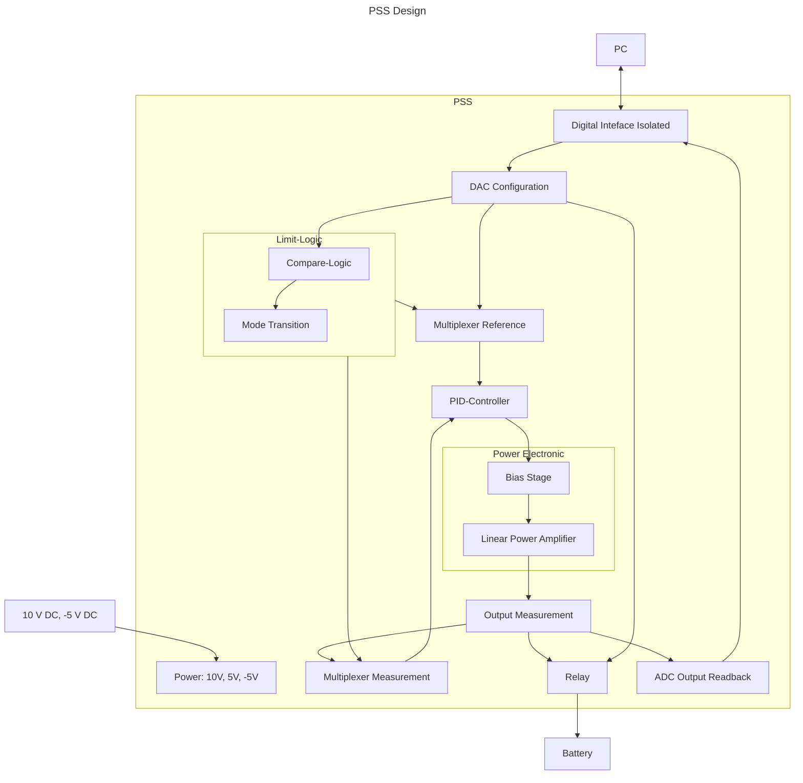

# Power Supply Sink

The Power Supply Sink is controlled from the PC via a programmable bus interface
to set the desired voltage, current or power.

## Interface & Requirements

1. SPI Input Interface
    - digital with $U \in [0V, 5V]$ relative to isolated ground `GNDI`
    isolation voltage max $V_{iso} = 500V$
        - `!CS_ISO`, input, chip select, low active
        - `SCLK_ISO`, input, serial clock CPHA=0, CPOL=0=`SCKL`
        - `SDI_ISO`, input, serial data in
        - `SDO_ISO`, output, serial data out
2. Voltage output
    - $U_{out} \in [0V, +5V]$
    - $I_{out} \in [-20A, +20A]$
    - Short circuit I limit $max(|I_{out}|) \leq |I_{max}| \leq |1.25 max(I_{out})|$
3. Supply Voltages
    - $+10V$ @ $260W$ ($26A$)
    - $-5V$ @ $180W$ ($26A$)

!!! warning "Supply Voltages"
    In order to achieve galvanic isolation the provided supply voltages must
    provide galvanic isolation. The `pss` output voltage is *not* isolated
    internally.

## Circuit Selection and Design

### SPI Configuration

The spi interface gives the possibility to

1. Write configuration from the `pc` to the `pss`
    - Channel Map available at [`./conf/channel_map.md`](./conf/channel_map.md)
    - Datasheet for *DAC* and SPI Commands [`../../hw/pss/datasheet/AD5672RBRUZ.pdf`](../../hw/pss/datasheet/AD5672RBRUZ.pdf)
2. Read output *voltage* from the `pss` to the `pc`
    - Datasheet for *ADC* and SPI Commands [`../../hw/pss/datasheet/ADS8665IPWR.pdf`](../../hw/pss/datasheet/ADS8665IPWR.pdf)
3. Read output *current* from the `pss` to the `pc`
    - Datasheet for *ADC* and SPI Commands [`../../hw/pss/datasheet/ADS8665IPWR.pdf`](../../hw/pss/datasheet/ADS8665IPWR.pdf)

### Circuit

The overview of the interconnections is given in the block diagram below. The
`pc` can program a configuration through the isolated spi `digital interface`.
The configuration is converted to the analog domain by the `DAC` and fed
through the `multiplexer` to the `controller`. The `controller` controls the
`power electronics` to achieve the desired reference quantity at the output,
which is measured by the `output measurement`. Depending on the configuration
the output is connected to or disconnected from the load by the `relay` sub
circuit. The measurements of the `output measurement` can also be read via
the `digital-interface`.

The configuration and output measurements are used by the `limit-logic` to
determine the control mode. (e.g. voltage control, upper current limit control,
...) The control mode is used to set the `multiplexe` to pass the correct
voltage and current of the configuration to the `controller` and provide the
appropriate measurement for the mode.

The power is provided by external isolated DC power supplies for the -5V and
+10V rail. The +5V rail used for the measurements and analog configuration is
generated internally.

#### Block Diagram

### Component Selection

#### Connector Terminal Blocks

Search on Mouser for terminal blocks [TDPT 2,5/ 2-SP-5,08](https://mou.sr/41gzUyX)

- Fixed Terminal Block
- PCB mounting
- Nominal current $I \geq 30A$
- Wire gauge $1.5mm^2 \leq A \leq 4mm^2$
- Push in type
- Pitch $5mm \leq d \leq 9mm$
- Sort by price
- Prefer family of parts with different multiplicity of connectors available

## Simulation

Simulation is available in `./pss.asc`.

## Hardware tests in Laboratory

## Layout and Assembly Considerations

### PCB Layout

- Pull up/down for inputs, when stage is isolated, to run other tests.
- Add disconnectors at outputs of sub circuits to obtain isolation for testing
- Place bulky components on single side of board to allow for reflow soldering
on both sides of pcb without use of adhesive glue

### Assembly

1. Pass tests for `power`
2. Connect power for `digital-interface` and pass tests
3. Connect power for `conf`, `adc`, `adc1`
4. Pass tests for `conf`
5. Pass tests for `adc`, `adc1`
6. Connect power for `relay` and pass tests
7. Connect power for `measurement` and pass tests
8. Connect power for `limit-logic` and pass tests
9. Connect power for `mux` and pass tests
10. Connect power for `control-var` and pass tests
11. Connect power for `power-electronics` and pass tests
12. Connect Solderbridges
    - JP107 - JP110
    - JP117 - JP126
    - JP101 - JP106
    - JP111 - JP112
    - JP113
    - JP116
    - JP127 - JP129
13. Pass tests for `pss`

### Open Circuit Test

Test ID: `v1.0.0/pss/open-circuit/<suffix>`

Available suffix:

- `voltage-control0`, `voltage-control3`, `voltage-control5`
- `lower-voltage-limit-control`, `upper-voltage-limit-control`

1. Connections
    - Output disconnected ($R \rightarrow \inf$)
    - SPI interface connected to `pc`
2. Power on supply voltage
3. Program Configuration with conf_output set
    - For suffix `voltage-control0`  
      refselect=U, $U=0V$, $I=1A$, $LVL=1V$, $UVL=4V$, $LCL=-10A$, $UCL=10A$
    - For suffix `voltage-control3`  
      refselect=U, $U=3V$, $I=1A$, $LVL=1V$, $UVL=4V$, $LCL=-10A$, $UCL=10A$
    - For suffix `voltage-control5`  
      refselect=U, $U=5V$, $I=1A$, $LVL=1V$, $UVL=4V$, $LCL=-10A$, $UCL=10A$
    - For suffix `upper-voltage-limit-control`  
      refselect=I, $U=3V$, $I=1A$, $LVL=1V$, $UVL=4V$, $LCL=-10A$, $UCL=10A$
    - For suffix `lower-voltage-limit-control`  
      refselect=I, $U=3V$, $I=-1A$, $LVL=1V$, $UVL=4V$, $LCL=-10A$, $UCL=10A$
4. Measure Voltages
    1. Output Voltage with multimeter $U_{out,multi}$
    2. Output Voltage with internal adc via spi $U_{out,spi}$
5. Power off supply voltage
6. Test passed if
    - For suffix `voltage-control0`  
      $U_{out,multi} \in U_{out,adc} \pm 100mV$
      $U_{out,multi} \in 0V \pm 100mV$
    - For suffix `voltage-control3`  
      $U_{out,multi} \in U_{out,adc} \pm 100mV$
      $U_{out,multi} \in 3V \pm 100mV$
    - For suffix `voltage-control5`  
      $U_{out,multi} \in U_{out,adc} \pm 100mV$
      $U_{out,multi} \in 5V \pm 100mV$
    - For suffix `upper-voltage-limit-control`  
      $U_{out,multi} \in U_{out,adc} \pm 100mV$
      $U_{out,multi} \in 4V \pm 100mV$
    - For suffix `lower-voltage-limit-control`  
      $U_{out,multi} \in U_{out,adc} \pm 100mV$
      $U_{out,multi} \in 1V \pm 100mV$

### Short Circuit Test

Test ID: `v1.0.0/pss/short-circuit/<suffix>`

Available suffix:

- `current-control0`, `current-control-20`, `current-control+20`
- `lower-current-limit-control`, `upper-current-limit-control`

1. Connections
    - Output disconnected ($R \rightarrow \inf$)
    - SPI interface connected to `pc`
2. Power on supply voltage
3. Program Configuration with conf_output set
    - For suffix `current-control0`  
      refselect=I, $U=2V$, $I=0A$, $LVL=0V$, $UVL=4V$, $LCL=-10A$, $UCL=10A$
    - For suffix `current-control-20`  
      refselect=I, $U=2V$, $I=-20A$, $LVL=0V$, $UVL=4V$, $LCL=-10A$, $UCL=10A$
    - For suffix `current-control+20`  
      refselect=I, $U=2V$, $I=+20A$, $LVL=0V$, $UVL=4V$, $LCL=-10A$, $UCL=10A$
    - For suffix `lower-current-limit-control`  
      refselect=U, $U=0V$, $I=1A$, $LVL=1V$, $UVL=4V$, $LCL=+1A$, $UCL=+10A$
    - For suffix `upper-current-limit-control`  
      refselect=U, $U=4V$, $I=1A$, $LVL=1V$, $UVL=4V$, $LCL=+1A$, $UCL=+10A$
4. Measure Current
    1. Output current with multimeter $I_{out,multi}$
    2. Output current with internal adc via spi $I_{out,spi}$
5. Power off supply voltage
6. Test passed if
    - For suffix `current-control0`  
      $I_{out,multi} \in I_{out,adc} \pm 1A$
      $I_{out,multi} \in 0A \pm 1A$
    - For suffix `current-control-20`  
      $I_{out,multi} \in I_{out,adc} \pm 1A$
      $I_{out,multi} \in -20A \pm 1A$
    - For suffix `current-control+20`  
      $I_{out,multi} \in I_{out,adc} \pm 1A$
      $I_{out,multi} \in +20A \pm 1A$
    - For suffix `lower-current-limit-control`  
      $I_{out,multi} \in I_{out,adc} \pm 1A$
      $I_{out,multi} \in +1A \pm 1A$
    - For suffix `upper-current-limit-control`  
      $I_{out,multi} \in I_{out,adc} \pm 1A$
      $I_{out,multi} \in +10A \pm 1A$
