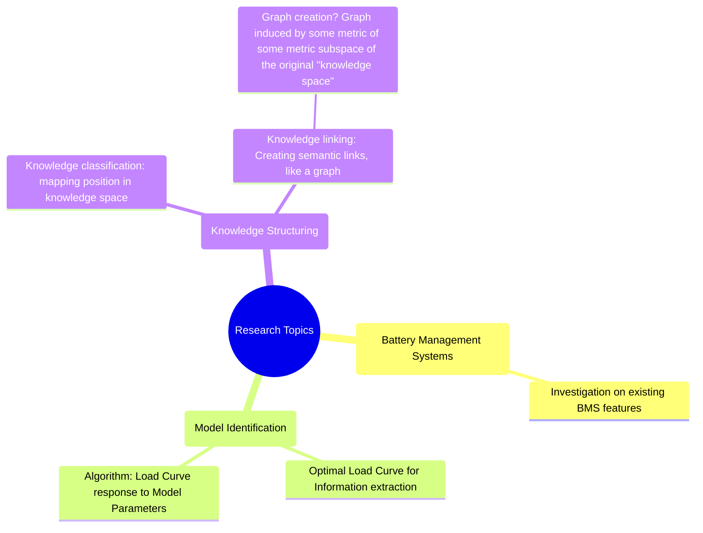

# Research Topics

```mermaid
mindmap
  ((Research Topics))
    (Battery Management Systems)
      Investigation on existing BMS features
    (Model Identification)
      Optimal Load Curve for Information extraction
      Algorithm: Load Curve response to Model Parameters
    (Knowledge Structuring)
      Knowledge classification: mapping position in knowledge space
      Knowledge linking: Creating semantic links, like a graph
        Graph creation? Graph induced by some metric of some metric subspace of the original "knowledge space"
```
