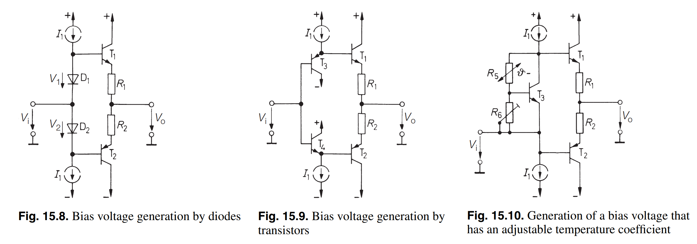
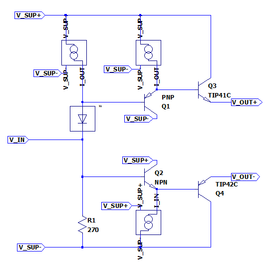
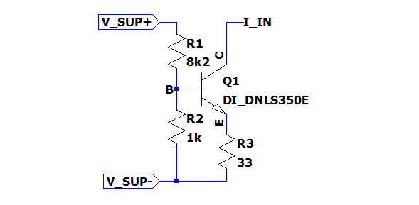

Bias Stage
==========

Bias and driver stage for the class AB output stage of the powersupplysink.

Interface & Requirements
------------------------

- Voltage Input
    - Voltage Input Swing $V_{in} \in [-2V, +6V] \subset [-3V, +8V]$
    - Input Current $| \pm I_{in} | \leq 20mA$
- Double voltage out with offset voltage
    - In phase with $V_{in}$
    - $V_{out-} \approx V_{in} - 0.6V + 1V = V_{in} + 0.4V$
    - $V_{out+} \approx V_{in} + 0.6V - 1V + V_{offset} = V_{in} + V_{offset} - 0.4V$
    - $V_{offset} \in [+0.73V, +1.8V]$
    - Output current $I_{out \pm} \geq \pm 800 mA$
- $V_{offset}$ adjustable via trimmer
- Supply Voltages
    - $+10V$ @ $?W$
    - $-5V$ @ $?W$

Circuit Selection and Design
----------------------------

### Literature Research for Available Options

Research in _Electronic Circuits_ by _Tietze, U. and Schenk, Ch._.[^1]
Chapter _15.2.3 Generation of Bias Voltage_ [^1] shows the following
possibilities to generate the bias voltages:

1. Bias voltage generation by diodes
    - symmetric
    - bias voltage fixed
    - low input impedance
    - rubber diode / VBE multiplier might be used instead of diodes
2. Bias voltage generation by transistors
    - symmetric
    - bias voltage fixed
    - high input impedance
    - rubber diode / VBE multiplier might be used additionally to increase bias
        voltage further to fixed value
3. Generation of a bias voltage that has an adjustable temperature coefficient
    - asymmetric
    - adjustable bias voltage (rubber diode / VBE multiplier)
    - temperature compensation possible
    - low input impedance

To reduce the required currents before the output current a transistor in common
collector circuit is used to reduced to boost the output current. Possibly
higher thermal dissipation is expected.
The current boost transistors can be driven by a circuit similar to (2.) with a
high input impedance. To achieve additional and adjustable offset voltage a
stage of (3.) can be preceded. With the modification of replacing the lower
current source of (3.) with a resistor an approximate idle point can be set
avoiding extreme outputs with high impedance input.

[^1]: 2008, Tietze, U. and Schenk, Ch.,
    "Electronic Circuits Handbook Design and Applications", Vol. 2,
    Springer-Verlag Berlin Heidelberg

### Overview

Overview of the used circuit.

### Current Boost Transistors

The Transistors _Q3_ and _Q4_ are referred to as the current boost transistors
and to reuse parts it is desired to reuse the already used parts _TIP41C_ and
_TIP42C_ from the outstage.

The critical condition of the current boost transistors is the dissipated power.
The maximum power is estimated in the worst case by a short connection of the
output through the outstage to the other voltage rail with maximum bias current.
Therefore the power will be
$$ P = U I = 10V 0.5A = 5W $$
Thus a heatsink with thermal resistance of $R_{th} < 15 K/W$ is required, which
can potentially be shared between the two transistors as they will not dissipate
the maximum power at the same time.

### Current Source Lowside

The required output current is approximately $500mA$, by _Q4_ in the overview
image the current is boosted and there fore a smaller base current of _Q4_ is
required. For a guaranteed $\beta_0 \ge 40$ of the transistors the base current
is $Q_{B4} = 500mA / 40 = 12.5mA$.
To drive the transistor _Q2_ even at high current demand with a forward current
through the collector emitter path the current source is constructed to have
$$ I_{src} = 2 \cdot Q_{B4} = 25mA $$
To achieve the maximum voltage swing at the output with an $VBE_{Q4} \approx 1V$
the current source shall require only approximately $U_{src,min} = - U_{sup-} +
U_{out,min} + VBE_{Q4} = +5V -3V -1V = 1V$ of voltage drop to function.

When neglecting the collector emitter voltage of the current limiting transistor
the resistor $R_{3}$ can be calculated as follows:
$$ R_{3} \approx \frac{U_{src,min}}{I_{src}} \approx 47 \Omega $$

By using $VBE$ of the current limiting transistor the required base voltage of
the transistor can be set by a voltage divider with a total current of
approximately $2.5 mA$ for a negligible influence of the required base current
as:
$$ R_1 = 8.2k \Omega \quad \and \quad R_2 = 1k \Omega $$

### Current Source Highside

The highside current source is designed complementary to the lowside current
source and for the slighty changed VBE of the complementary transistor the
voltage divider is calculated as:
$$ R_1 = 8.2k \Omega \quad \and \quad R_2 = 1.2k \Omega $$

Simulation
----------

Hardware tests in Laboratory
----------------------------

Layout and Assembly Considerations
----------------------------------

- Heatsink for current boost transistors can be shared.

Commissioning and Testing
-------------------------

