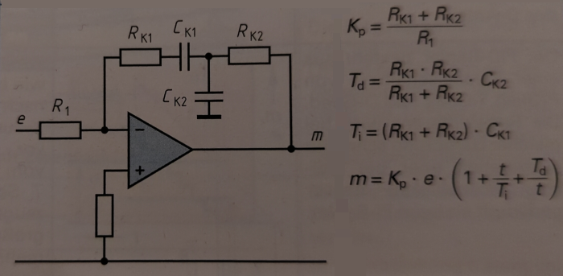
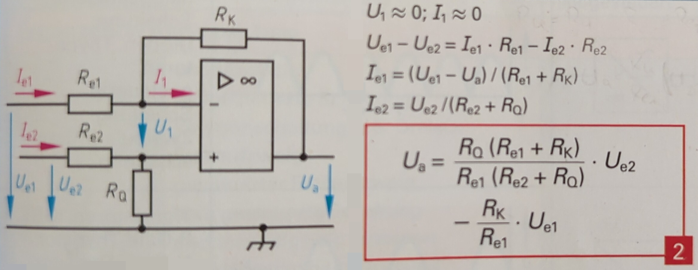

Control
=======

Interface & Requirements
------------------------

TODO: Add Requirements and Interface

Circuit Selection and Design
----------------------------

### Circuit

TODO: Add feed forward, offset

As the circuit a classical control loop is selected with a reference that should
be tracked by minimizing the error.
The PID controller is implemented using a standard circuit from literature [^TB]:

The difference junction is implemented using a standard subtraction circuit from literature [^TB]:

[^TB]: Europa-Lehrmittel, Tabellenbuch Elektrotechnik, 2018

#### PID Controller Component Values

The parasitic capacitance together with the resistance of $R_{K1} + R_{K2}$ acts
as a low pass filter, which adds a pole to closed loop system. In order to
neglect the influence of the pole it's frequency should be higher than the
operating frequency. For the [OPA2810IDR] the parasitic capacitance
$C_{parasitic} \approx C_{in} + C_{diff} = 3 pF$. For a operating frequency $f
= 10 MHz$ a higher frequency of $f' = 2 \cdot f = 20 MHz$ is chosen and the
feddback resistance is limited by:
$$ R_{K1} + R_{K2} < \frac{1}{2 \pi f' C_{parasitic}} = 2.65 k \Omega $$

A lower limit of the feedback resistance is imposed by the maximum output current of the [OPA2810IDR].
The maximum continous output current is $40mA$, but to limit the thermal stress
of the device the output current is desired to not exceed $30mA$. The current
available for the feedback path is the remaining current, which is not used for
the following bias stage.
$$ R_{K1} + R_{K2} > \frac{U_{signal,max}}{I_{out,max} - I_{bias}} \approx
\frac{10V}{30mA - 20mA} = 1k \Omega $$

Thus the range considering the integration time $T_i$ is
$$ C_{K1} = \frac{T_i}{R_{K1}+R_{K2}} \in [89 pF, 236 pF] $$

Choosing from E6 $C_{K1} = 100pF \implies R_{K1}+R_{K2} = 2.36 k \Omega$.

To reuse same component values we can choose
$$ C_{K2} = 100pF = C_{K1} \implies
R_{K1} || R_{K2} = \frac{T_d}{C_K2} = 588 \Omega \approx 0.5 (R_{K1}+R_{K2}) $$

Thus we can select $$ R_{K1} = R_{K2} = 1.2 k \Omega $$
$$ \implies R_1 = \frac{R_{K1}+R_{K2}}{K_P} = 240 \Omega $$.

#### Difference Junction

To minimize the number of different components at unity gain for each channel
of the subtraction circuit we choose R_{e1} = R_{e2} = R_K = R_Q$.
The same restrictions apply for the feedback resistance as in the PID
controller, because the input resistance of the PID with
$$ R_{in,PID} \approx R_1 = 240 \Omega \implies I_{in,PID,max} \approx
\frac{u_{e,max}}{R_{in,PID}} = 20 mA $$.

Therefore we can select
$$ R_{e1} = R_{e2} = R_K = R_Q = 2.2 k \Omega $$

### Component Selection

#### Operational Amplifier

[OPA2810IDR] Selection (sort by Price): $n_{Ch} >= 2$, $GBWP
\approx 100 MHz$, 15V VCC, $SR \approx 150 V / \mu s$

!!! note "GBWP & SR"
    The GBWP is approximated by using the approximate oparating frequency $f$ of
    the closed loop control loop and the desired gain $K_P$.
    $$ GBWP \approx f \cdot K_P = 10 MHz \cdot 10 $$
    The slew rate is approximated by taking the maximum slope of a sine wave at
    maximum amplitude at the approximated operating frequency. $$ SR \approx 2.5V
    \cdot 10 MHz \cdot 2 \pi $$

[OPA2810IDR]: https://mou.sr/3X9Oofi

#### Analog Bidirectional Switch

[CD4066BM96] Selection (sort by Price): 4x SPST, SMD, 15V VCC,
$R_{on} <= 250 \Omega$

[CD4066BM96]: https://mou.sr/3MQOnJI

Simulation
----------

TODO: link to simulation files

Hardware tests in Laboratory
----------------------------

Layout and Assembly Considerations
----------------------------------

### PCB Layout

- Low impedance decoupling of opamp
- Low impedance feedback of opamp (avoid parasitic capacitance)

### Assembly

Commissioning and Testing
-------------------------

TODO: Add tests
