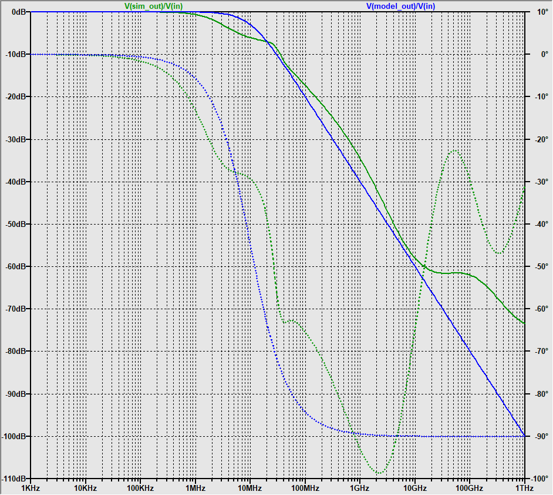

Controller Design
=================

Power Electronics Model
-----------------------

The plant model corresponds to the power electronics including the outstage and
the bias stage. The simulation `../../sim_bias+outstage_ac.asc` is used to
generate the bode plot of power electronics. A first order model is fitted by
manual inspection of the bode plot. The model is expected to be unreliable at
frequencies above $f > 100MHz$.

### Enhancements

The model is only fitted approximately, and for low frequencies the fit can
probably be improved by adding a pair of complex conjugated zeros in the range
$f \in [1 MHz 20 MHz]$. To make the plant model strictly proper the addition of
two poles at high frequencies would also be required. A fitting function via
least square is implemented in `./tfest.py`. The convergence of the estimation
is very slow and results could only be achieved with initial conditions, which
are close to the global extreme.

Controller Design
-----------------

### PI - Root Locus

TODO: Add PI controller doc

### Linear Quadratic Integral Compensator

TODO: Add lqi design
