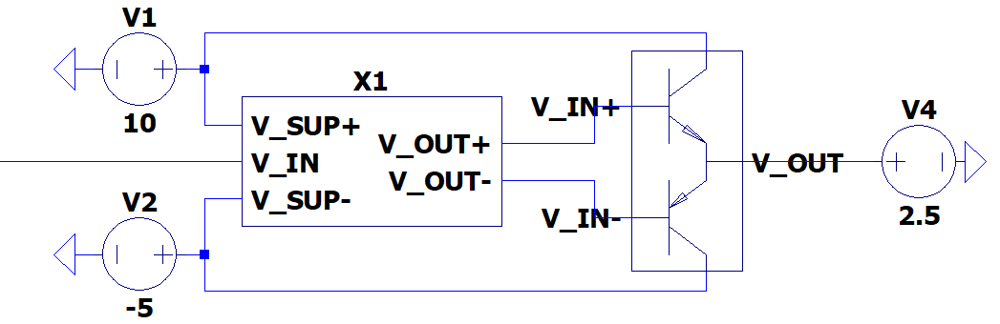

# PowerSupplySink

## Power Electronics

### Interface & Requirements

See input interface of [bias](./bias/bias.md) and output interface of
[outstage](./outstage/outstage.md).

### Circuit Selection and Design

### Simulation

See `./sim_bias+outstage.asc` for simulation.

### Hardware Tests in Laboratory

### Layout and Assembly Considerations

- (Dis-) connector between _bias_ and _outstage_, (solderbridge / jumper)
    Label with testname hint

### Commissioning and Testing

1. Pass all tests for _bias_
2. Pass all tests for _outstage_
3. Connect _bias_ and _outstage_

